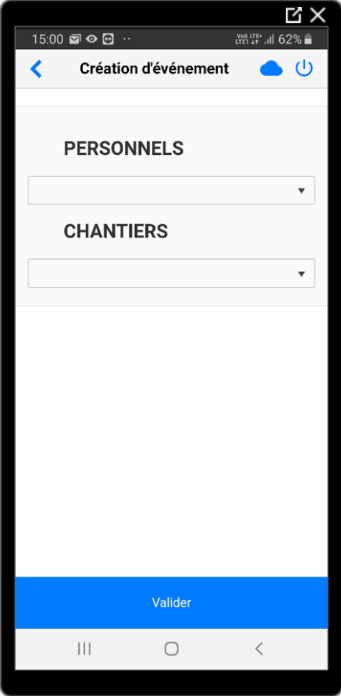
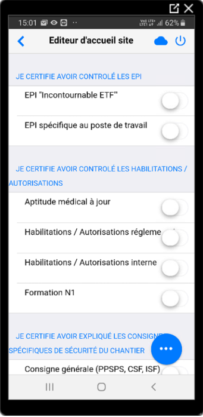
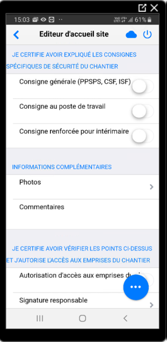
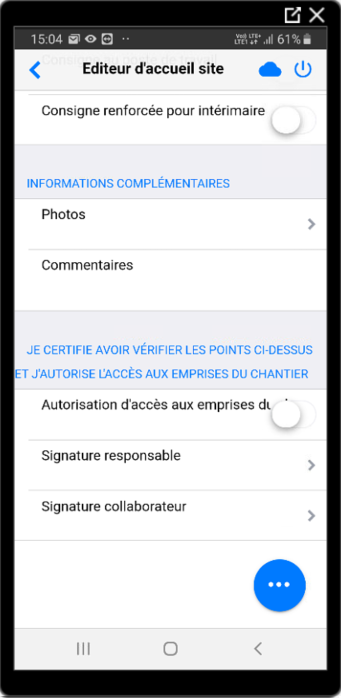

=======================
Accueil Site - SECUFER
=======================

Ajouter un accueil
------------------

Vérifier les habilitations
***************************

Avant de commencer à créer un rapport d'autorisation d'accès aux emprises ferroviaires, vous devez vérifier si la personne est habilité pour entrer sur le site et effectuer ses taches.

Si la personne possède un vbadge, scannez son QR Code.

Sinon la personne doit au minimum présenter :
    - Sa visite médicale règlementaire
    - Sa formation N1

.. warning::
    Sans le vbadge ou une version papier des documents, l'accès au site doit être refusé.

Créer un nouveau rapport
*************************

1. Lancez VPGO

2. Selectionnez le planning : ETF_RAPPORT_V3

3. Sélectionnez le rapport : Accueil Site

4. Cliquez sur le boutton ajouter en bas

5. Renseignez le nom - prénom de la personne et le numéro d'OTP du site

6. Remplissez les informations suivantes :

