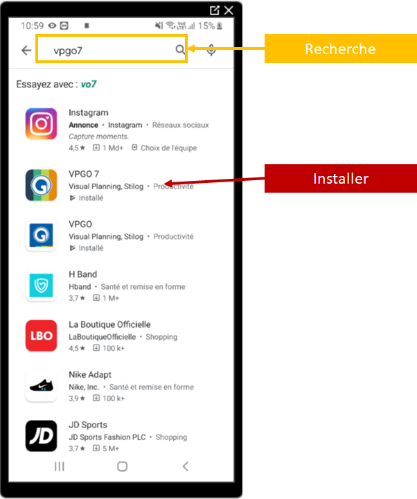
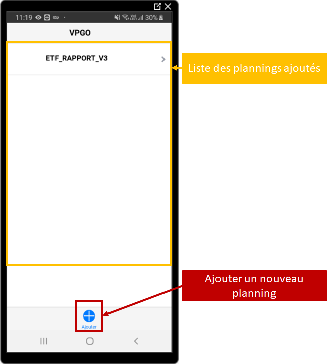
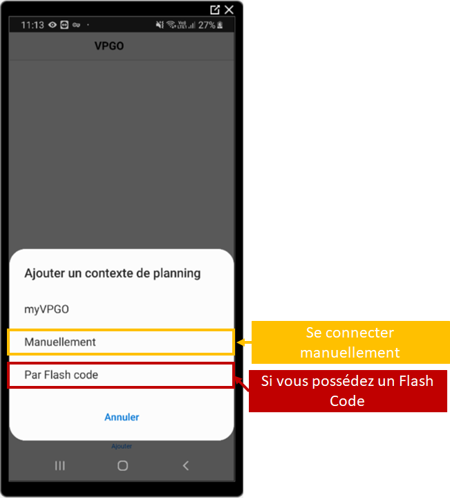

==================
Installation VPGO
==================

Préambule
----------

VPGO est l'application mobile de Visual Planning permettant de remplir des formulaires.

Installation
------------

1. Lancez ``Google Play`` qui permet d'installer des applications sur votre smartphone android.

2. Recherchez ``VPGO`` puis cliquez sur ``installer``.

3. Lancez VPGO pour commencer le paramétrage.

Paramétrage
-----------

Pour ajouter un planning cliquez sur le ``+`` situé en bas de l'écran puis sélectionnez ``Par Flash code``.

Scannez l'un des deux codes selon ce que vous souhaitez utiliser de VPGO :

    ETF_RAPPORT_V3 :
        - Rapports soudures et meulages
        - Rapport KN
        - Rapport Accueil Site - SECUFER

Le planning apparaîtra sur la page d'accueil VPGO.

Se connecter
------------

Pour vous connecter, appuyez sur le planning et connectez vous avec vos identifiants Visual Planning.

Identifiant
***********

Votre identifiant est composé de la façon suivante : ::

    Première lettre du prénom + Nom

Lors de votre première connexion laissez votre mot de passe vide, Visual Planning vous demandera d'en définir un pour votre compte.

Le mot de passe doit être composé de : ::

    - Une lettre
    - Un chiffre
    - Au moins 4 caractères

.. note::
    Ce mot de passe n'a pas besoin d'être modifié.

.. warning::
    Si vous n'avez pas encore de compte visual planning ou que vous ne vous souvenez plus de votre mot de passe contactez :
        - Maxime CORDIER : maxime.cordier@etf.fr
        - Julien GUY : julien.guy@etf.fr