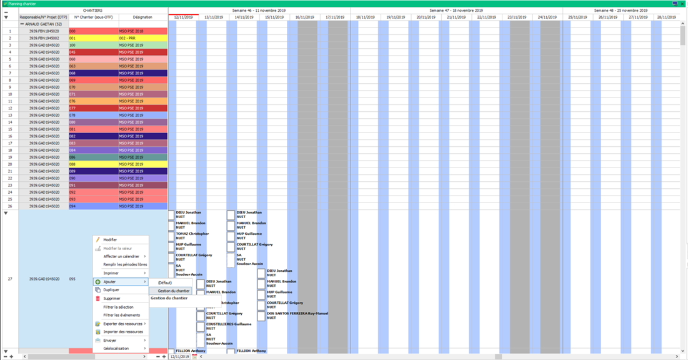
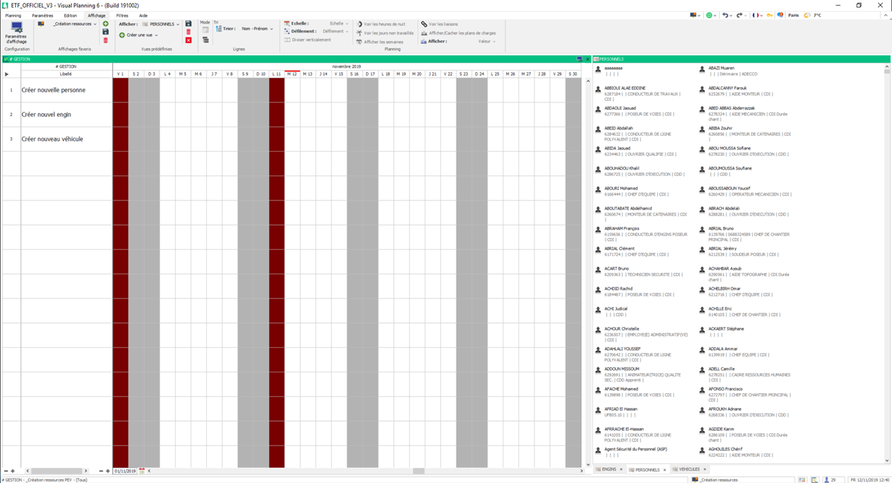

=========================
Création de ressource
=========================

Création basique
-----------------

La création basique est la méthode normal pour créer des ressources.

Dans une vue ``liste de ressource`` ou dans la partie ``liste de ressource d'un planning``, vous devez cliquer droit puis sélectionner ``ajouter`` pour ajouter une ressource.

Exemple : Ajout d'un chantier

.. note::
    Lorsque vous voulez ajouter une ressource, vous pouvez avoir plusieurs ``editeurs de saisie`` :
        - L'éditeur : ``défaut`` n'est pas mis en forme
        - Les éditeurs portant un noms sont mis en forme

    **Préférez utiliser les éditeurs mis en forme.**

Pour aller plus vite dans votre création vous pouvez cliquer droit sur une ressource déjà existante et cliquer sur ``Dupliquer``

.. warning::
    Lors de la duplication d'une ressource, modifiez bien toutes les informations qui ne doivent pas être reprise de la ressource dupliquée.

Création de Personnel, Engin et véhicules
-----------------------------------------

Pour créer du personnel, un engin ou un véhicule vous devez utiliser l'affichage ``_Création ressources``.

Cet affichage est découpé en deux parties :
    - Planning gestion qui permet de positionner un événement de création de ressource
    - Ressource personnel, engin et véhicule qui permet de vérifier si la ressource n'éxiste pas.

1. Vérifiez que la ressource n'éxiste pas :
    1.1. Cliquez droit sur la barre de la vue puis faite : Rechercher -> Nom - Prénom (Ou une autre rubrique si vous le souhaitez)

    .. image:: ../_static/fonctionnalitees/creation_ressource/liste_personnel_recherche.png

    1.2. Préférez utiliser la recherche ``contient`` pour vérifier si la ressource n'éxiste pas.

    .. image:: ../_static/fonctionnalitees/creation_ressource/recherche.png

    1.3. Si la liste est vide, la ressource n'éxiste pas et vous pouvez la créer.
2. Double cliquez à une date sur la ligne de la ressource que vous souhaitez créer.
3. Choisissez le secteur dans lequel la ressource sera créée.
    3.1. N'hésitez pas à selectionner le filtre : ``_Mon secteur`` pour réduire la liste des secteurs rapidement

    .. image:: ../_static/fonctionnalitees/creation_ressource/liste_chantier.png

4. Renseignez les informations de la ressource.

    .. image:: ../_static/fonctionnalitees/creation_ressource/ajout_personne.png
