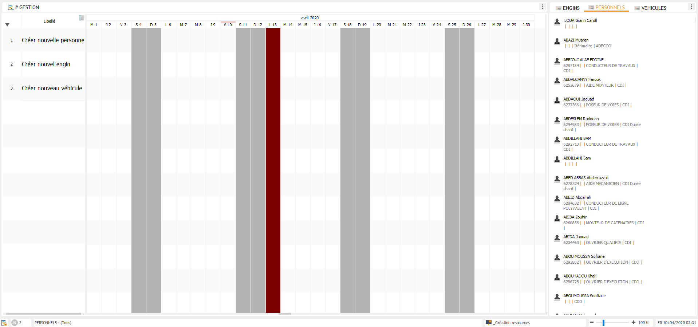
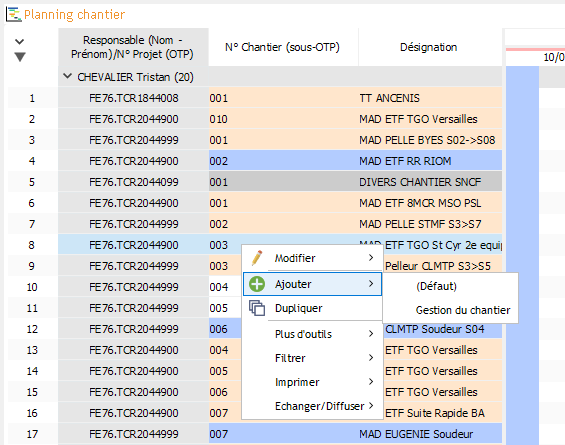

=========================
Création de ressource
=========================

Cas du Personnel, des Engins ou des Véhicules
---------------------------------------------

Pour créer ces 3 types de ressources, vous devez utiliser l'affichage ``_Création ressources``.

Cet affichage est découpé en deux parties :
    - Un planning (à gauche) : permet de générer une création de ressource
    - Une liste de ressources par type (à droite) : permet de vérifier si la ressource n'existe pas déjà.

1. Vérifier que la ressource n'existe pas :
    1.1. Cliquer droit sur le nom de la "vue ressource" correspondante puis : ``Rechercher`` > ``Nom - Prénom`` OU ``N° Equipement`` en fonction du type (ou une autre rubrique vous permettant d'identifier la ressource).

    .. image:: ../_static/fonctionnalitees/creation_ressource/v7_liste_personnel_recherche.png

    1.2. Préférer utiliser la méthode de recherche ``contient`` (plutôt que ``égale à``) puis taper la valeur à rechercher.

    .. image:: ../_static/fonctionnalitees/creation_ressource/v7_recherche.png

    1.3. Si la liste est vide (= sans résultat), la ressource n'existe pas et vous pouvez donc passer à l'étape suivante.

2. Dans le planning, double-cliquer à une date donnée et sur la ligne correspondant au type de ressource souhaité.

3. Choisir le secteur dans lequel la ressource devra être créée.
    3.1. Penser à selectionner le filtre ``_Mon secteur`` pour réduire la liste des secteurs rapidement.

    .. image:: ../_static/fonctionnalitees/creation_ressource/liste_chantier.png

4. Renseignez les informations de la ressource.

    .. image:: ../_static/fonctionnalitees/creation_ressource/v7_ajout_personne.png

5. Enfin, un événement apparaît dans le planning. Dans un délai de 15 minutes, la ressource sera automatiquement générée ou, à défaut, l'événement passera au rouge avec un message d'erreur.

Autres cas (Chantiers, Périodes, Activités, ...)
------------------------------------------------

Pour les autres ressources, la méthode est simplifiée.

Dans une ``Vue Ressources`` ou dans la partie gauche (ressources) d'une ``Vue Planning``, vous devez cliquer droit puis sélectionner ``Ajouter``.

Exemple : Ajout d'un chantier (à partir d'un planning des chantiers)

.. note::
    Lorsque vous voulez ajouter une ressource, vous avez généralement le choix entre plusieurs ``éditeurs de saisie`` :
        - L'éditeur ``(Défaut)`` est l'interface générique de Visual Planning (non mis en forme)
        - Les éditeurs nommés (ici, ``Gestion du chantier``) sont mis en forme par nos soins

    **Bien que le résultat final soit équivalent, nous vous conseillons d'utiliser les éditeurs nommés.**

Pour gagner du temps lors de la création, vous pouvez cliquer droit sur une ressource déjà existante (et similaire à celle que vous souhaitez créer) puis cliquer sur ``Dupliquer``.

.. warning::
    Lors de la duplication d'une ressource, modifiez bien toutes les informations qui ne doivent pas être reprises.

    Il est également possible que le message suivant apparaisse : "Voulez-vous dupliquer les événements ?"
    **ATTENTION : TOUJOURS REPONDRE [ NON ] A CETTE QUESTION !!!**

