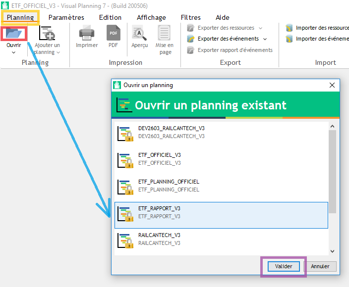
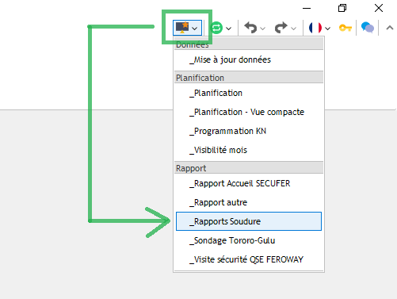
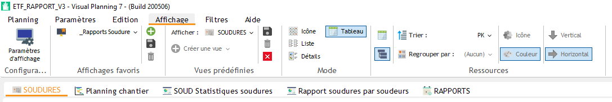
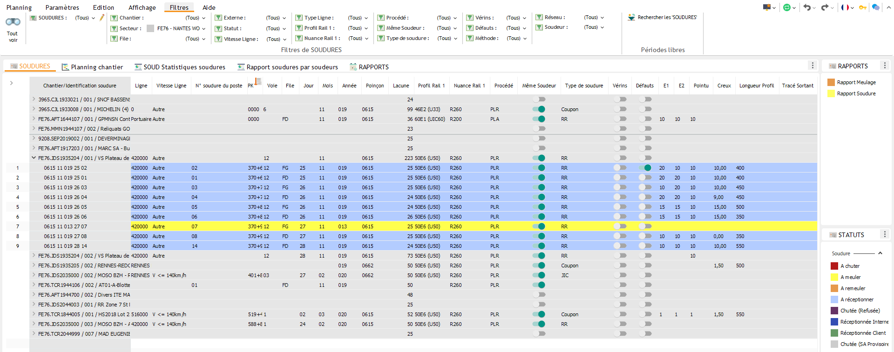
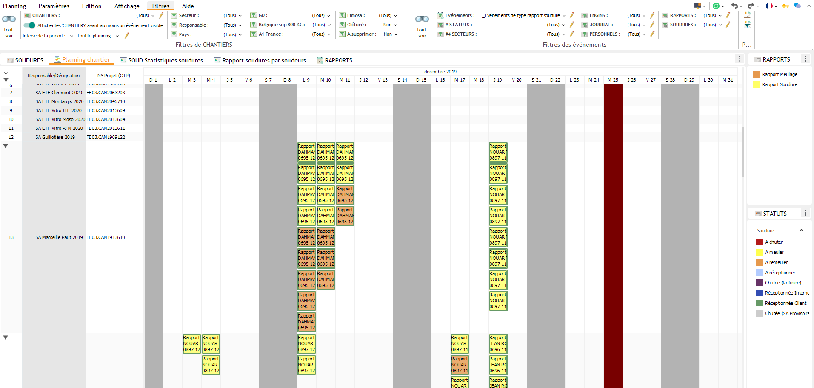
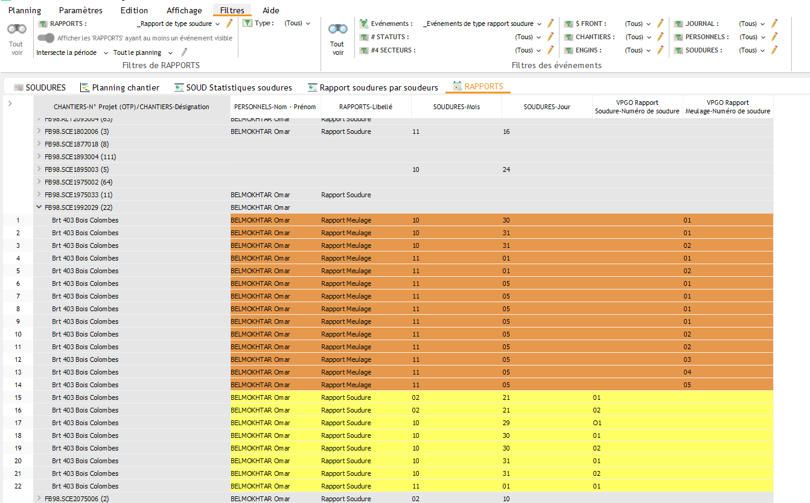
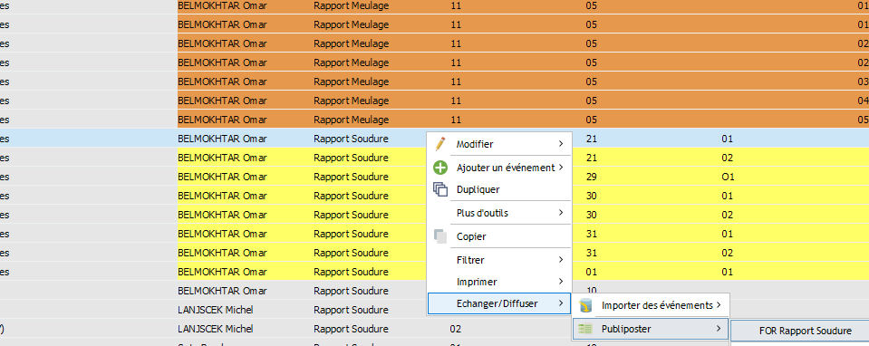

============================
Gestion des Rapports Soudure
============================

!! ATTENTION !!
---------------

Vous avez probablement l'habitude de travailler sur le planning **ETF_OFFICIEL_V3**. La gestion des soudures se fait sur le planning **ETF_RAPPORT_V3**. 
Pour s'y connecter : 
    * Cliquez sur le 1er onglet de Visual Planning ``[ Planning ]`` (en haut à gauche),
    * Puis sur le dossier "bleu",
    * Sélectionnez ``ETF_RAPPORT_V3`` dans la liste qui vient de s'ouvrir,
    * Validez.

Affichage Rapport Soudure
-------------------------

Une fois sur le bon planning, sélectionnez dans la liste des ``Affichages favoris`` (raccourci en haut à droite de la fenêtre) ``_Rapports Soudure``.

Cet affichage est constitué de différentes vues, notamment :
    * Une liste des ressources **SOUDURES**,
    * Une vue planning chantier pour observer les rapports de soudure sur un calendrier,
    * Une liste d'événements **RAPPORTS**.

Liste des Soudures
******************

[ 1er onglet à gauche ] Cette vue permet d'observer les différentes soudures, classées par chantier.

La couleur de la ligne indique le statut actuel de la soudure :
    .. image:: ../_static/fonctionnalitees/rapport_soudure/vue_liste_statuts_soudure.png

Vue Planning des Rapports Soudure
*********************************

[ 2e onglet ] La vue planning permet d'observer les événements de rapports soudure (soudure/meulage) sous fourme de calendrier, classés par chantier.

.. note::
    Vous pouvez éditer un rapport de soudure ou de meulage à partir de cette vue.

Une fois la soudure identifiée, faites un clic-droit dessus > ``Echanger/Diffuser`` > ``Publiposter`` > ``FOR Rapport Soudure``.

Enfin, cliquez sur ``Oui`` pour afficher le document puis le sauvegarder sur votre poste.

Liste des Rapports Soudure
**************************

[ Dernier onglet ] Cette vue représente l'ensemble des événements de rapports soudure sous forme de liste.

.. note::
    Vous pouvez éditer un rapport de soudure ou de meulage à partir de cette vue.

Une fois la soudure identifiée, faites un clic-droit dessus > ``Echanger/Diffuser`` > ``Publiposter`` > ``FOR Rapport Soudure``.

Enfin, cliquez sur ``Oui`` pour afficher le document puis le sauvegarder sur votre poste.