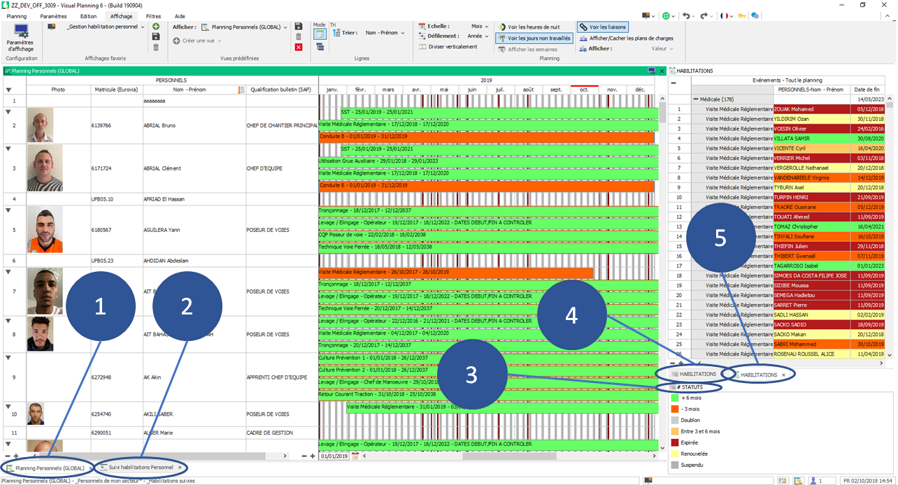
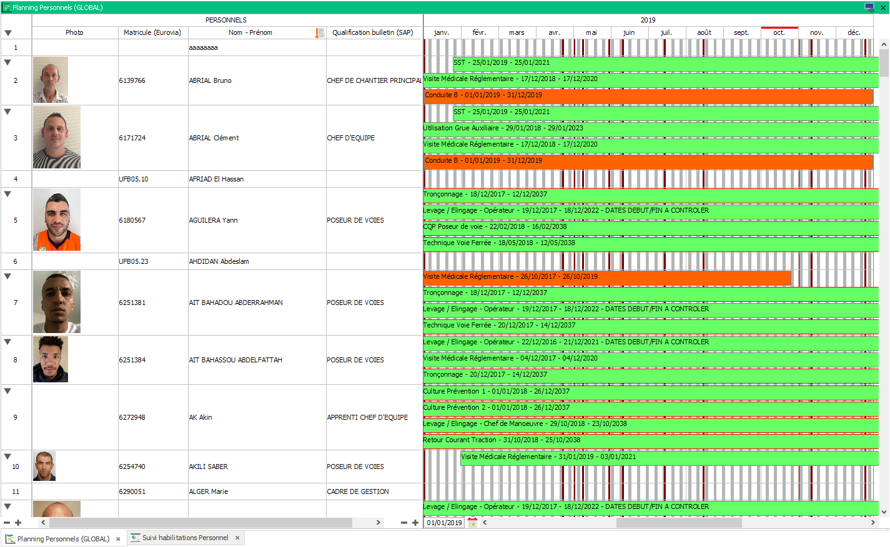
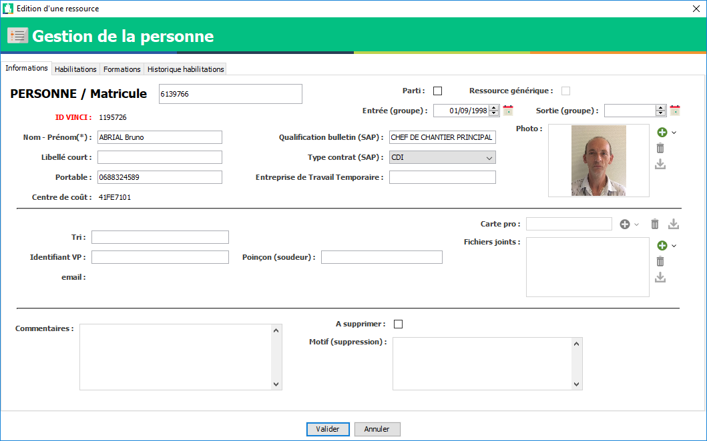
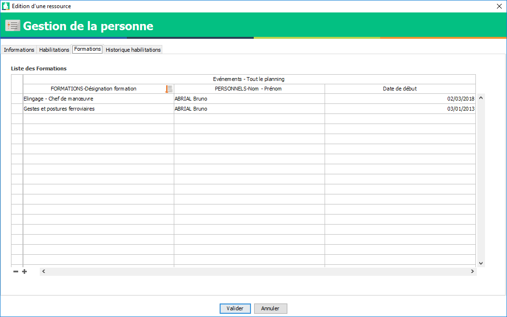
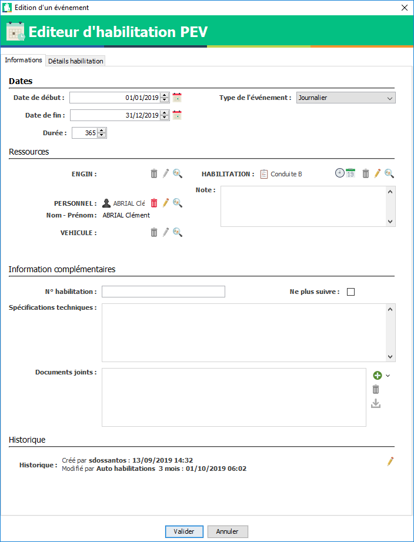
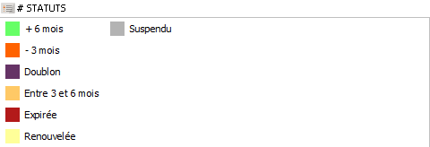

==========================
Habilitation et formation
==========================

Préambule
---------

Sur Visual Planning la formation et l'habilitation **sont deux événements distinct**.

**La formation** se planifie sur un planning pour "bloquer" les dates et heures de formations de la même manière qu'une planification de chantier ou d'absence.

A la fin de la formation celle-ci peut-être **habilitante** : cette habilitation doit être ajoutée manuellement sur la personne.

.. warning::
    Les habilitations peuvent être ajoutées sur tout le personnel renseignés dans Visual Planning, cependant il existe deux sortes de personnels :
        - Le personnel créé manuellement (L'ID VINCI commence par U)
        - Le personnel importé de Kheops (L'ID VINCI normal)
    Vous aurez, lors de la planification d'habilitation sur le personnel créé manuellement, une alerte vous expliquant que
    "Toute personne créée manuellement ne pourra pas avoir de badge VBadge".
    Pour plus d'information, veuillez vous référez au **Rapprochement** :


Documentations reliées
**********************

Comment filtrer
Import automatique
Rapprochement

Présentation de la gestion des habilitations
--------------------------------------------

L'affichage
***************

Rendez-vous sur l'onglet ``affichage`` puis dans la liste des affichages cherchez : ``_Gestion habilitation personnel``

Vous arriverez sur cet affichage :



Cet affichage est découpé en 5 vues :

Planning des habilitations du personnel
^^^^^^^^^^^^^^^^^^^^^^^^^^^^^^^^^^^^^^^^



Vous y retrouvez :

    Les informations de votre personnels :
        - Photo
        - Matricule (Eurovia)
        - Nom - Prénom
        - Qualification de bulletin

    Le planning des habilitations pour pouvoir modifier ou ajouter une habilitation

- Lorsque vous double cliquez sur une personne dans la liste, vous ouvrez **l'éditeur de personnel**
- Lorsque vous double cliquez sur un événement sur le planning, vous ouvrez **l'éditeur d'habilitation**

Editeur personnel
$$$$$$$$$$$$$$$$$

Pour modifier les informations de la personne : Onglet ``Information``



.. warning::


Pour voir les habilitations suivies sous forme de liste : Onglet ``Habilitations``

.. image:: ../_static/fonctionnalitees/habilitation_formation/fiche_personne_habilitation.png

Voir les formations planifiées : Onglet ``Formation``



Voir l'historique des habilitations : Onglet ``Historique des habilitations``

.. image:: ../_static/fonctionnalitees/habilitation_formation/fiche_personne_historique_habilitation.png

Editeur événement habilitation
$$$$$$$$$$$$$$$$$$$$$$$$$$$$$$

**Double cliquer** sur un événement dans le planning ou dans l'onglet ``habilitation`` de la personne ouvre son éditeur :



Exemples de modifications :
    - La date de début de l'habilitation
    - La date de fin de l'habilitation
    - La note
        - Vous permet d'annoter une information non officiel sur cette habilitation
            - Exemple 1 : Formation effectué le ....
            - Exemple 2 : Recyclage demandé par ... le ...
    - Le numéro d'habilitation
        - C'est le numéro de session ou numéro de l'habilitation communiqué par l'organisme
    - Les spécifications techniques
        - Vous permet de spécifier certaines options ou remarques faîtes concernant l'habilitation
            - Exemple 1 : Restriction médical : Port de lunette
            - Exemple 2 : Option
    - Les documents joints
        - Ces documents seront acceccible depuis VBADGE. (Pour plus d'information référé vous à la documentation VBADGE)
    - La case à chocher ne plus suivre
        - Permet de ne plus suivre pas défaut cette habilitation
            - Cas 1 : Je souhaite faire dispaître cette habilitation de la fiche personne tout en gardant l'historique de celle-ci
            - Cas 2 : L'habilitation est expirée et je ne veux pas la recycler

Liste des événements habilitations
^^^^^^^^^^^^^^^^^^^^^^^^^^^^^^^^^^

Par défaut cet affichage est trié avec le filtre : ``_Habilitations qui vont être perdues`` (Date de fin < 3 mois)

Cela vous permet d'identifier rapidement les habilitations qui nécessitent une attention.

.. note::
    **Double cliquer** sur une ligne du tableau ouvre l'éditeur de saisie d'événement habilitation.

.. image:: ../_static/fonctionnalitees/habilitation_formation/evenement_habilitation.png

.. note::
    Vous pouvez aussi utiliser les filtres :
        ``_Habilitations suivies`` : toutes les habilitations sauf ``Renouvelée``, ``Non suivi`` et ``Doublon``
        ``_Historique des habilitations`` : Toutes les habilitations sans distinction

Liste des statuts
^^^^^^^^^^^^^^^^^^^^



+-------------------+---------------------------------------+
|  Libellé          |   Condition                           |                               
+===================+=======================================+
|                    **Automatique**                        |
+-------------------+---------------------------------------+
|   \+ 6 mois       | | Date de fin > 6 mois                |
+-------------------+---------------------------------------+
| Entre 3 et 6 mois | |  mois < Date de fin < 6 mois        |
+-------------------+---------------------------------------+
|   \- 3 mois       | | Date de fin < 3 mois                |
+-------------------+---------------------------------------+
|   Expirée         | | Date de fin < 0 jour                |
+-------------------+---------------------------------------+
|                   | | Date de fin 1 = Date de fin 2       |
|   Doublon         | | Habilitation 1 = Habilitation 2     |
|                   |                                       |
+-------------------+---------------------------------------+
|                   | | Habilitation 1 = Habilitation 2     |
|   Renouvelée      | | L'une des deux est plus récente     |
|                   |                                       |
+-------------------+---------------------------------------+
|                    **Manuel**                             |
+-------------------+---------------------------------------+
|   Suspendu        | | Pour suspendre une habilitation     |
+-------------------+---------------------------------------+

.. note::
    - Le seul statut que vous pouvez positionner manuellement est le statut ``Suspendu`` qui permet  de notifier que la personne est suspendu sur cet habilitaiton.
    - Les autres statuts sont automatiques

Liste des habilitations
^^^^^^^^^^^^^^^^^^^^^^^^

Utilisation du glisser/déposer sur le planning habilitation pour ajouter une habilitation à une personne.

    .. image:: ../_static/fonctionnalitees/habilitation_formation/liste_habilitation.png    

.. warning::
    Lorsque vous placer une habilitation sur une personne créée manuellement dans Visual Planning, vous aurez un message
    d'alerte vous indiquant que celle-ci n'apparaîtra pas dans VBADGE : Aller voir la section Vbadge

- Par défaut vous voyez dans cette vue :
    | ```Libellé de l'habilitation``
    | ``Libellé complet de l'habilitation``, ``durée automatique lors de la planification``, ``0 = sans recyclage | 1 = recyclage``

- **Double cliquer** sur une habilitation pour avoir plus d'informations sur celle-ci :

    .. image:: ../_static/fonctionnalitees/habilitation_formation/editeur_habilitation.png

Tableau de suivi des habilitations
^^^^^^^^^^^^^^^^^^^^^^^^^^^^^^^^^^^^

    - Permet d'avoir une vue global des habilitations de son périmètre
    - Est affiché le nombre de jour restant avant recyclage
    - Les couleurs correspondent aux statuts des autres vues

    .. image:: ../_static/fonctionnalitees/habilitation_formation/tableau_suivi_habilitation.png

    .. note::
        | Utiliser les filtres pour épurer le tableau.
        | Exemple 1 : ``Recyclage : Non`` si vous ne voulez pas voir les habilitations ne nécessitant pas de recyclage
        | Exemple 2 : ``_Choix de l'habilitation`` permet de choisir uniquement une habilitation

Pas à Pas
---------

iuhhojij