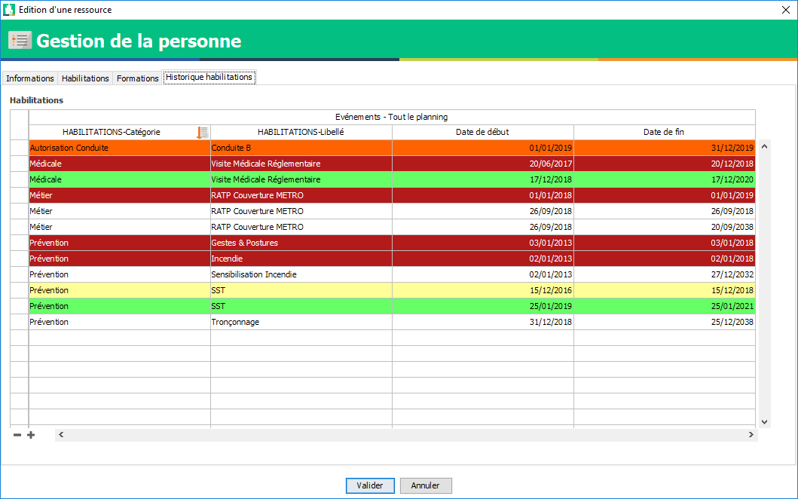

==========================
Habilitation et formation
==========================

Préambule
---------

Sur Visual Planning la formation et l'habilitation **sont deux événements distinct**.

La formation se planifie sur un planning pour "bloquer" les dates et heures de formations de la même manière qu'une planification de chantier ou d'absence.

A la fin de la formation celle-ci peut-être habilitante : cette habilitation doit être ajoutée manuellement sur la personne.

Les habilitations sont attachées à la personne, en cas de retour d'une ressource ou d'une mutation celle-ci récupère les habilitations déjà renseignées.

Documentation supplémentaire à voir
***********************************

Comment filtrer

Pourquoi renseigner les habilitations sur Visual Planning ?
***********************************************************

- Chaque secteur ou agence utilisait leur propre solution de suivi dont certaines nécessitait un maintenance lourde et manuelle.
- Une base de données communes pour ETF permet de croiser les données.
- Au 1er janvier 2020, l'accueil site ou "SECUFER" doit être opérationnel. La dématérialisation de cet accueil site nécessite de pouvoir controler les habilitations de manière beaucoup plus efficace sur les chantier.
- Arriver à la dématérialisation des cartes d'habilitations

Habilitation
-------------

Les fonctionnalités de gestions des habilitations et formations se trouvent sur le planning ``ETF_OFFICIEL_V3``

L'affichage
***************

Rendez-vous sur l'onglet ``affichage`` puis dans la liste des affichages cherchez : ``_Gestion habilitation personnel``

Vous arriverez sur cet affichage :

.. image:: ../_static/fonctionnalitees/habilitation_formation/affichage_gestion_habilitation.png

Cet affichage est découpé en 5 vues :

Planning des habilitations du personnel
^^^^^^^^^^^^^^^^^^^^^^^^^^^^^^^^^^^^^^^^


Sur cette vue vous retrouvez :
    - Les informations de votre personnels :
        - Photo
        - Matricule (Eurovia)
        - Nom - Prénom
        - Qualification de bulletin
    - Le planning des habilitations pour pouvoir modifier ou ajouter une habilitation

Editeur personnel
$$$$$$$$$$$$$$$$$

**Double cliquer** sur une personne pour ouvrir sa fiche :

Pour modifier les informations de la personne : Onglet ``Information``

.. image:: ../_static/fonctionnalitees/habilitation_formation/fiche_personne.png

Pour voir les habilitations suivies sous forme de liste : Onglet ``Habilitations``

.. image:: ../_static/fonctionnalitees/habilitation_formation/fiche_personne_habilitation.png

Voir les formations planifiées : Onglet ``Formation``


Voir l'historique des habilitations : Onglet ``Historique des habilitations``



Editeur événement habilitation
$$$$$$$$$$$$$$$$$$$$$$$$$$$$$$

**Double cliquer** sur un événement dans le planning ou dans l'onglet ``habilitation`` de la personne ouvre son éditeur :

.. image:: ../_static/fonctionnalitees/habilitation_formation/editeur_evenement_habilitation.png

Les informations que vous êtes les plus a mêmes de modifier sont :
    - La date de début de l'habilitation
    - La date de fin de l'habilitation
    - La note
        - Vous permet d'annoter une information non officiel sur cette habilitation
            - Exemple 1 : Formation effectué le ....
            - Exemple 2 : Recyclage demandé par ... le ...
    - Le numéro d'habilitation
        - C'est le numéro de session ou numéro de l'habilitation communiqué par l'organisme
    - Les spécifications techniques
        - Vous permet de spécifier certaines options ou remarques faîtes concernant l'habilitation
            - Exemple 1 : Restriction médical : Port de lunette
            - Exemple 2 : Option
    - Les documents joints
        - Ces documents seront acceccible depuis VBADGE. (Pour plus d'information référé vous à la documentation VBADGE)
    - La case à chocher ne plus suivre
        - Permet de ne plus suivre pas défaut cette habilitation
            - Cas 1 : Je souhaite faire dispaître cette habilitation de la fiche personne tout en gardant l'historique de celle-ci
            - Cas 2 : L'habilitation est expirée et je ne veux pas la recycler

Liste des événements habilitations
^^^^^^^^^^^^^^^^^^^^^^^^^^^^^^^^^^

Par défaut cet affichage est trié avec le filtre : ``_Habilitations qui vont être perdues`` (Date de fin < 3 mois)

Cela vous permet d'identifier rapidement les habilitations qui nécessitent une attention.

.. note::
    **Double cliquer** sur une ligne du tableau ouvre l'éditeur de saisie d'événement habilitation.

.. image:: ../_static/fonctionnalitees/habilitation_formation/evenement_habilitation.png

.. note::
    Vous pouvez aussi utiliser les filtres :
        ``_Habilitations suivies`` : toutes les habilitations sauf ``Renouvelée``, ``Non suivi`` et ``Doublon``
        ``_Historique des habilitations`` : Toutes les habilitations sans distinction

Liste des statuts
^^^^^^^^^^^^^^^^^^^^


+-------------------+---------------------------------------+
|  Libellé          |   Condition                           |                               
+===================+=======================================+
|                    **Automatique**                        |
+-------------------+---------------------------------------+
|   \+ 6 mois       | | Date de fin > 6 mois                |
+-------------------+---------------------------------------+
| Entre 3 et 6 mois | |  mois < Date de fin < 6 mois        |
+-------------------+---------------------------------------+
|   \- 3 mois       | | Date de fin < 3 mois                |
+-------------------+---------------------------------------+
|   Expirée         | | Date de fin < 0 jour                |
+-------------------+---------------------------------------+
|                   | | Date de fin 1 = Date de fin 2       |
|   Doublon         | | Habilitation 1 = Habilitation 2     |
|                   |                                       |
+-------------------+---------------------------------------+
|                   | | Habilitation 1 = Habilitation 2     |
|   Renouvelée      | | L'une des deux est plus récente     |
|                   |                                       |
+-------------------+---------------------------------------+
|                    **Manuel**                             |
+-------------------+---------------------------------------+
|   Suspendu        | | Pour suspendre une habilitation     |
+-------------------+---------------------------------------+

.. note::
    - Le seul statut que vous pouvez positionner manuellement est le statut ``Suspendu`` qui permet  de notifier que la personne est suspendu sur cet habilitaiton.
    - Les autres statuts sont automatique

Liste des habilitations
^^^^^^^^^^^^^^^^^^^^^^^^

Utilisation du glisser/déposer sur le planning habilitation pour ajouter une habilitation à une personne.

    .. image:: ../_static/fonctionnalitees/habilitation_formation/liste_habilitation.png    

.. warning::
    Lorsque vous placer une habilitation sur une personne créée manuellement dans Visual Planning, vous aurez un message
    d'alerte vous indiquant que celle-ci n'apparaîtra pas dans VBADGE : Aller voir la section Vbadge

- Par défaut vous voyez dans cette vue :
    | ```Libellé de l'habilitation``
    | ``Libellé complet de l'habilitation``, ``durée automatique lors de la planification``, ``0 = sans recyclage | 1 = recyclage``

- **Double cliquer** sur une habilitation pour avoir plus d'informations sur celle-ci :

    .. image:: ../_static/fonctionnalitees/habilitation_formation/editeur_habilitation.png

Tableau de suivi des habilitations
^^^^^^^^^^^^^^^^^^^^^^^^^^^^^^^^^^^^

    - Permet d'avoir une vue global des habilitations de son périmètre
    - Est affiché le nombre de jour restant avant recyclage
    - Les couleurs correspondent aux statuts des autres vues

    .. image:: ../_static/fonctionnalitees/habilitation_formation/tableau_suivi_habilitation.png

    .. note::
        | Utiliser les filtres pour épurer le tableau.
        | Exemple 1 : ``Recyclage : Non`` si vous ne voulez pas voir les habilitations ne nécessitant pas de recyclage
        | Exemple 2 : ``_Choix de l'habilitation`` permet de choisir uniquement une habilitation
