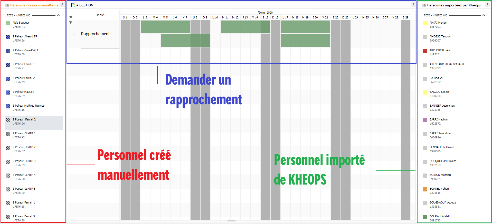
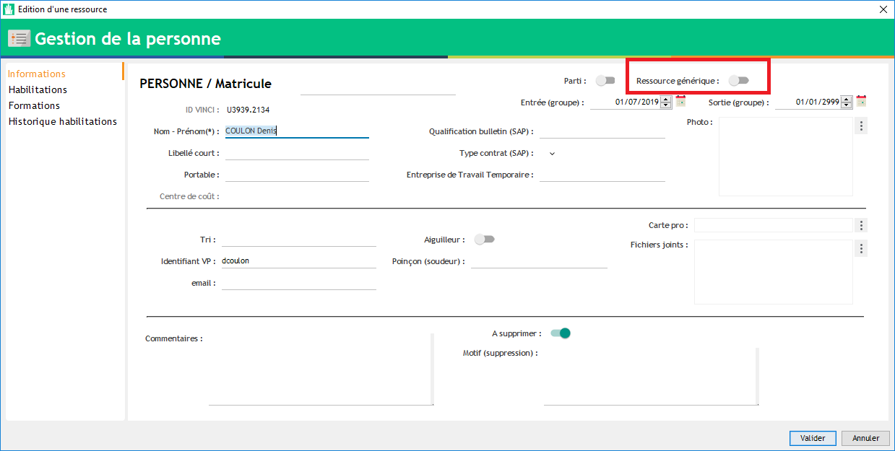
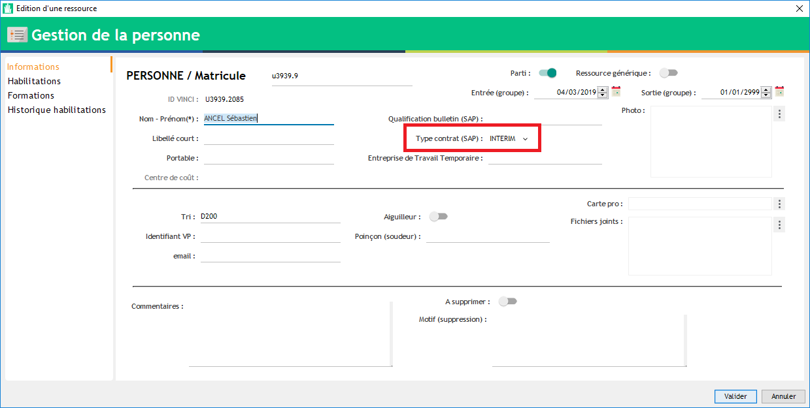

=============
Rapprochement
=============

Dans Visual Planning, le rapprochement permet de fusionner une personne créée manuellement avec une personne importée depuis KHEOPS.

.. warning::
    Il faut au maximum planifier et placer des habilitations sur des personnes importées de KHEOPS.

    Pour l'instant, une personne créée manuellement ne peut pas avoir de vbadge.

Tous les événements et les informations renseignées dans la fiche de la personne créée manuellement seront transférés vers la personne importée de KHEOPS.

L'affichage
-----------

L'affichage s'intitule ``_Gestion des imports KHEOPS`` (dans la partie *Données*).

Cet affichage est décomposé en 3 vues :
    - Les personnes créées manuellement dans mon secteur (à gauche)
    - La planning (au centre) permettant de générer des événements de "demande de rapporchement"
    - Les personnes importées automatiquement de KHEOPS dans mon secteur (à droite)

Le principe
-----------

Lorsqu'une ressource est importée automatiquement de KHEOPS (**et que vous l'aviez déjà créée manuellement**), vous vous retrouvez généralement avec un doublon dans vos affichages (planification, habilitation, ...).
Pour se débarrasser de ce doublon, nous allons utiliser l'affichage ``_Gestion des imports KHEOPS`` et effectuer un rapprochement (voir plus bas).

.. warning::
    Vous aviez peut-être pris l'habitude, jusque-là, de passer une des 2 ressources en ``A supprimer``. Attention, la méthode ``A supprimer`` n'est utile que dans le cas où l'on aurait créé manuellement 2 fois la même personne. 
    
    Pour rappel, si vous souhaitez simplement masquer une ressource (intérimaire en période de carence, personnel sorti des effectifs, ...), utiliser la case à cocher ``Cacher``.

Objectif :
    Dans l'affichage ``_Gestion des imports KHEOPS``, le but est de vider au maximum la vue de gauche (liste des personnes créées manuellement). Nous verrons plus bas comment faire.

.. note::
    Vous avez probablement renseigné des données sur les deux personnes (créée et importée) car cette méthode de rapprochement n'existait pas encore. Il est donc important de vérifier les règles ci-dessous avant de lancer le processus de rapprochement.

.. warning::
    - Seuls les utilisateurs disposant du droit de ``REFERENT`` peuvent effectuer un rapprochement.
    - Le processus de rapprochement **copie** les informations de la personne créée manuellement et les **colle** sur la personne importée de KHEOPS. **Cela écrase donc les données existantes dans la fiche de la personne (importée de KHEOPS).**
        - 0. Si vous n'avez jamais ajouter/modifier d'information sur la personne importée de KHEOPS, vous pouvez passer les étapes 1 et 2.
        - 1. Vérifier qu'il n'y ait aucun document ou photo à récupérer sur la personne importée de KHEOPS.
        - 2. Dans le cas contraire, sauvegarder-les sur votre ordinateur puis réinsérer-les **après le rapprochement**.
    - Le processus de rapprochement **coupe** les événements de la personne créée manuellement et les **colle** sur la personne importée de KHEOPS. **Cela n'écrase pas les événements déjà présents sur la personne importée de KHEOPS.**
    - Les filtres rapides ``Cacher``, ``A supprimer`` ou ``Sortie KHEOPS`` peuvent vous aider dans votre tâche.

[ 1 ] Le rapprochement
**********************

1. Glissez / Déposez la personne souhaitée, depuis la vue de gauche, à une date donnée sur le planning :
    - La date choisie n'a pas d'importance,
    - L'événement créé est bleu, ce qui indique qu'un nouveau rapprochement a été généré mais de manière incomplète : il manque l'information ``ID VINCI`` permettant de faire le lien avec la personne importée de KHEOPS.

    .. image:: ../_static/fonctionnalitees/rapprochement/v7_nouveau_rapprochement_1.png

    .. image:: ../_static/fonctionnalitees/rapprochement/v7_nouveau_rapprochement_2.png

2. Recherchez la même personne (importée de KHEOPS) dans la vue de droite afin de pouvoir lire son ``ID VINCI``.

3. Ouvrez l'éditeur du rapprochement (double-clic sur l'événement bleu) et recopiez l'``ID VINCI`` (observé dans la liste de droite) dans le champ prévu à cet effet (dans l'éditeur) :

    .. image:: ../_static/fonctionnalitees/rapprochement/v7_editeur_rapprochement.png

    .. image:: ../_static/fonctionnalitees/rapprochement/v7_eve_rapprochement_complet.png

5. Validez (le traitement s'effectura dans un délai de 15 minutes).

.. warning::
    Veillez à recopier strictement l'ID VINCI (sans espace avant, ni après) ; dans le cas contraire, il faudra alors répéter l'opération à partir de l'étape 3.

La couleur de l'événement indique où en est le traitement du rapprochement :
    - Bleu (Nouveau),
    - Orange (Modifié et prêt à être traité),
    - Rouge (Erreur sur l'événement, vérifier le message dans la note ou contacter le service informatique),
    - Vert (Traité).

.. note::
    Contrairement aux événements de création de ressources, les événements de rapprochement ne disparaissent pas du planning à la fin du traitement.
    
    De plus, une fois le rapprochement terminé, la personne (créée manuellement) n'est pas supprimée ; elle est juste marquée ``A supprimer``.

.. warning::
    Si vous constatez une erreur dans le rapprochement, contactez le service informatique.

[ 2 ] Les ressources génériques
*******************************

Une **ressource générique** est une ressource qui n'est pas nominative. Elle ne nécessitera donc pas de rapprochement. On les utilise généralement en cas de prestations temporaires mais répétées au cours de l'année. 

Exemple d'utilisation :
    - Equipe soudure en location (externe au groupe),
    - Intérimaire (renfort),
    - Annonceur (prestation de sécurité ferroviaire).

Dans la fiche de la ressource générique (``PERSONNELS``), vous pouvez cocher la case ``Ressource générique``. En procédant ainsi, vous ne verrez plus les ressources génériques dans l'affichage ``_Gestion des imports KHEOPS``.

.. note::
    Cocher la case ``Ressource générique`` ne fait pas disparaître cette ressource de vos autres affichages.

[ 3 ] Les intérimaires
**********************

Les intérimaires n'étant pas importés de KHEOPS pour le moment, il n'est pas possible de les rapprocher.
Les intérimaires ne sont pas affichés dans la partie des ressources créées manuellement.

Si un intérimaire apparaît dans cette liste, vérifiez que la rubrique ``Type contrat (SAP)`` (dans sa fiche PERSONNELS) n'est pas positionnée sur ``INTERIM``.

.. warning::
    Dans le cas où l'intérimaire est embauché, il vous suffit de changer son type de contrat (``INTERIM`` --> ``CDD`` / ``CDI``) puis de revenir sur l'affichage pour faire le rapprochement avec son import KHEOPS.
