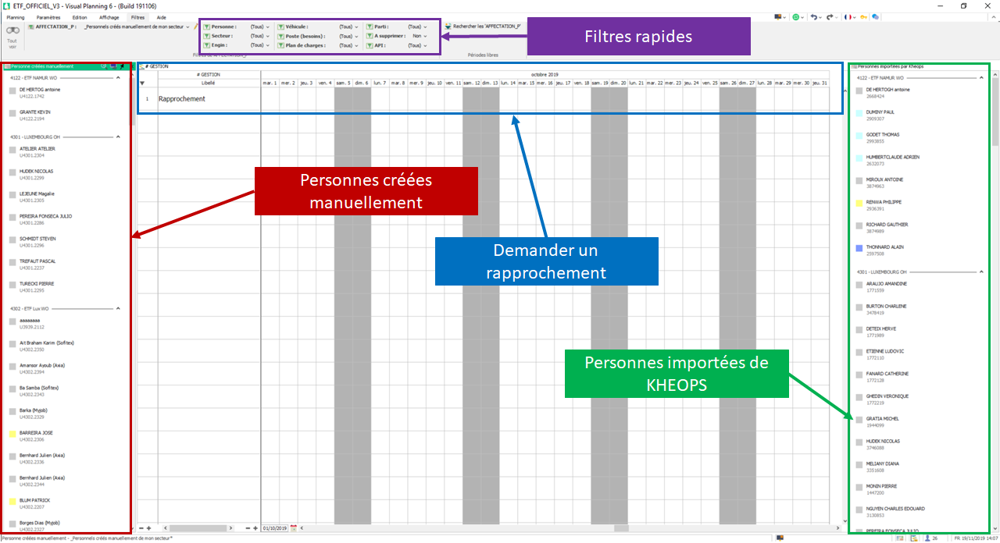
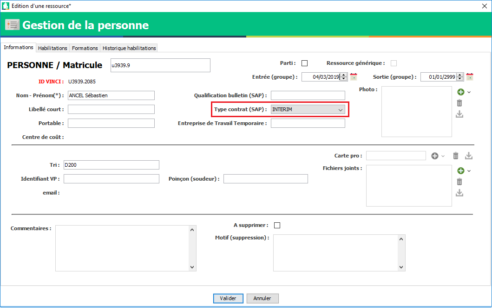

=============
Rapprochement
=============

Le rapprochement permet de fusionner une personne créée manuellement avec une personne importée depuis KHEOPS.

.. warning::
    Il faut au maximum planifier et placer des habilitations sur des personnes importées de KHEOPS.

    Pour l'instant, une personne créée manuellement ne peut pas avoir de vbadge.

Tous les événements et les informations renseignés dans la fiche de la personne créée manuellement seront transféré sur la personne KHEOPS.

L'affichage
-----------

L'affichage est décomposé en 3 vues :
    - Les personnes créées manuellement de mon secteur
    - La planning des rapprochements pour faire la demande de rapprochement
    - Les personnes importées de KHEOPS de mon secteur

Le principe
-----------

Objectif 1 :
    Lorsqu'une ressource est importées de KHEOPS et que vous l'aviez créée manuellement, vous allez vous retrouver avec un doublon.
    Il ne faut plus passer le doublon en ``à supprimer`` mais aller chercher l'affichage : ``_Gestion des imports KHEOPS`` et effectuer un rapprochement.

Objectif 2 :
    Il faut vider la vue de gauche (personnes créées manuellement)

Pour se faire vous avez trois choix :

Le rapprochement
*****************
.. warning::
    Quelques règles avant de commencer :
        - Uniquement les utilisateurs du groupe ``REFERENT`` peuvent placer des événements de rapprochement.
        - Le rapprochement ``copie`` les informations de la personne créée manuellement et les ``colles`` sur la personne importées de KHEOPS. (**Cela écrase les données existantes dans la fiche de la personnes**)
            1. Vérifiez qu'il n'y a pas de document ou photo associée à la personne importée de KHEOPS.
            2. Si c'est le cas et que ces documents ne sont pas sur la personne créée manuellement, sauvegarder les sur votre ordinateur puis venez les réinsérer dans la fiche de la personne après le rapprochement.
        - Le rapprochement ``coupe`` les événements de la personne créée manuelle et les ``colles`` sur la personne importées de KHEOPS. (**Cela n'écrase pas les événements déjà en place mais ces événements n'existent plus sur la ressource initiale**)
        - Vérifiez que vous avez bien ``Glissé/Déposé`` une personne créée manuellement pour positioner l'événement de rapprochement et copié l'ID VINCI de la personne importées par KHEOPS. (**Vous risqueriez de perdre les données de la fiche de la personne créée manuellement**)
        - Utiliser au maximum les filtres rapides :
            - Les filtres comme : ``Parti \ A supprimer`` peuvent vous aider dans votre tâche

.. note::
    Il est important de vérifier les règles ci-dessus pour le lancement du processus de rapprochement. Vous avez pus avoir été amené à renseigné des données sur les deux ressources car le rapprochement n'existait pas.
    
    A partir d'aujourd'hui et après avoir rapproché tout le personnel possible, ce process est amené à faire le rapprochement des deux ressources dès l'importation de la personne KHEOPS. **Il n'y aura donc aucune données sur la personne KHEOPS**.

1. Glissez / Déposez la personne créées manuellement de la vue de gauche sur une date sur le planning
    - Peu importe la date
    - L'événement est bleu pour vous indiquez qu'il vient d'être créé et qu'il n'a pas encore d'ID VINCI attribué

    .. image:: ../_static/fonctionnalitees/rapprochement/nouveau_rapprochement.png

2. Recherchez la même personne importées de KHEOPS dans la vue de droite
3. Ouvrez sa fiche pour récupérer son ``ID VINCI``

    .. image:: ../_static/fonctionnalitees/rapprochement/fiche_personnel.png

4. Copiez cet ``ID VINCI`` et copiez le dans le champ ``ID VINCI`` de l'événement

        .. image:: ../_static/fonctionnalitees/rapprochement/ev_rapprochement.png

    .. image:: ../_static/fonctionnalitees/rapprochement/modifie_rapprochement.png

5. Validez (le traitement s'effectura dans les 15min).

Les couleurs indiques ou en est le traitement du rapprochement :
    - Bleu (Nouveau)
    - Orange (Modifié)
    - Rouge (Erreur sur l'évément, vérifier la note ou contactez le service informatique)
    - Vert (Traité)

    .. image:: ../_static/fonctionnalitees/rapprochement/traite_rapprochement.png

Lorsque l'événement est vert, si vous rechargez la page de gestion des rapprochements, la personne que vous avez rapprocher devrait avoir disparu de la liste de gauche.

Vous pouvez aussi vérifier le avant/après en ouvrant la fiche de la personne créée manuellement puis en allant dans l'onglet ``Paramètres`` pour y voir sa liste d'événements.

    .. image:: ../_static/fonctionnalitees/rapprochement/fiche_personnel_ev.png    

La personne créée manuellement ne devrait plus avoir d'événements et la personne importées devrait les avoir récupérés.

.. note::
    La personne dont le rapprochement à été traité n'est pas supprimée, elle est juste marquée comme : ``A supprimer`` pour vérifier que tous c'est bien déroulé comme prévu

.. warning::
    Dans le cas ou vous constatez une erreur dans le rapprochement, contactez le service informatique

La ressource générique
**********************

Une ressource dites générique est une ressource qui n'est pas nominative, elle ne nécessitera donc pas d'être rapprochées.

Exemple :
    - Equipe soudure
    - Intérimaire 1
    - Appel d'offre

Dans la fiche de la ressource, vous pouvez cocher la case : ``ressource générique`` qui permettra de faire disparaître la ressource dans la liste de gauche.

.. image:: ../_static/fonctionnalitees/vbadge/editeur_personne_generique.png

.. note::
    Cocher la ressource en ``ressource générique`` ne l'a fait pas disparaître de vos autres affichages. Cela permet de diminuer la liste des ressources à rapprocher pour une meilleur lisibilité.

Les intérimaires
****************

Les intérimaires n'étant pas importé de KHEOPS pour le moment, il n'est pas possible de les rapprocher.
Les intérimaires ne sont pas affichés dans la partie des ressources créées manuellement.

Si un intérimaire apparaît dans la liste, c'est que son ``type de contrat`` dans sa fiche n'est pas positionné sur ``Intérimaire``

.. warning::
    Dans le cas ou l'intérimaire est embauché par l'entreprise et qu'il est importé par kheops, il vous suffit de changer dans sa fiche son type de contrat intérimaire en CDD ou CDI puis de revenir sur l'affichage pour faire le rapprochement avec son import KHEOPS.
