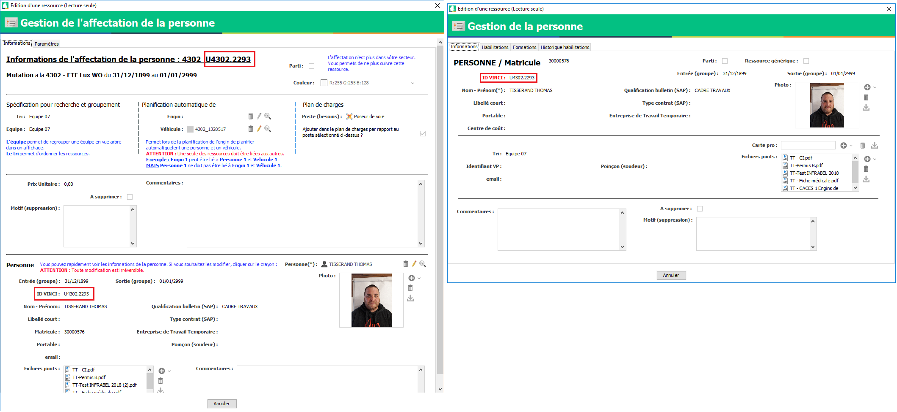

.. vbadge:

==========================
Vbadge
==========================

Préambule
---------

Vbadge est une carte distribuée aux collaborateurs permettant grâce à un **QR Code** imprimé dessus de récupérer ses habilitations / autorisations.

    .. image:: ../_static/fonctionnalitees/vbadge/badge_jean.png

    .. image:: ../_static/fonctionnalitees/vbadge/badge_jeanne.png

Les habilitations / autorisations sont reliées directement à Visual Planning.

    .. image:: ../_static/fonctionnalitees/vbadge/fiche_jeanne.png

Qui peut avoir une carte ?
--------------------------

Seul les personnes importées à partir de KHEOPS peuvent avoir une carte.

C'est à dire :
    - CDI
    - CDD
    - CDIC

.. warning::
    Les ``Intérimaires`` et ``Stagiaires`` sont les seules ressources qui ne peuvent pas obtenir de carte.

    Vous ne pouvez pas demander une carte pour une personne créée manuellement dans Visual Planning.

Comment reconnaitre une ressource créée manuellement ?
------------------------------------------------------

Une personne créée manuellement à un ID VINCI commençant par ``U`` pour Utilisateur, ainsi que le code du secteur de la ressource et un compteur.

Exemple : ``U + SSSS + . + COMPTEUR`` = ``U4302.2293``

Vous pouvez le vérifier à plusieurs endroits dans l'affichage ou dans les éditeurs de saisies : ``AFFECTATION PERSONNEL`` + ``PERSONNEL``

.. note::
    Pour toute personne créée manuellement et qui est en doublon parce qu'elle a été importée de KHEOPS, vous devez effectuer un ``Rapprochement``.

    Vous pouvez aller voir la documentation sur ce sujet.

Demander une carte pour un collaborateur
----------------------------------------

Pour demander une carte vbadge, il faut commencer par vérifier les points suivants concernant le collaborateur :
    - Photo
    - Nom - Prénom
    - Qualification de bulletin

Ces informations doivent être corrigées avant la demande car elles sont inscrites sur la carte qui sera donnée aux collaborateurs.

Après avoir vérifier les données, vous pouvez faire la demande au service informatique par mail qui vous envera la carte.

Explication de la fiche vbadge
-------------------------------

La fiche d'une personne reprend les informations principales situées en en-tête de la page ainsi que des tableaux récapitulatifs de ses habilitations / autorisations.

Les couleurs
+++++++++++++

La couleur verte indique la ``Validité`` d'une habilitation / autorisation

La couleur rouge indique ``l'Invalidité`` d'une habilitation / autorisation

    .. image:: ../_static/fonctionnalitees/vbadge/fiche_jeanne_couleur.png

.. note::
    Sur cet exemple Jeanne a sa visite médicale à jour (Vert : Valide) mais son habilitation B0 est expirée (Rouge : Invalide)

L'en-tête
++++++++++

L'en-tête reprend des informations **importantes** pour l'accueil d'un collaborateur sur site.

Il est possible d'y retrouver :
    - Un scan de la carte pro BTP en cliquant sur le logo
    - Si le N1 et la formation SECUFER sont à jour
    - Si la visite médicale est à jour
    - Si les critères requis pour accueillir le collaborateur sur site sont respecté le logo ``Autorisé`` apparaît sinon il devient ``Non Autorisé``

    .. image:: ../_static/fonctionnalitees/vbadge/fiche_jean_explicative.png

.. note::
    Sur cet exemple Jean n'est pas autorisé à rentrer sur chantier car les crièteres requis ne sont pas valides. (Les logos sont rouges)

Le corp de la fiche
++++++++++++++++++++

Le corp de la fiche reprend les listes des habilitations / autorisations.

Lorsqu'un symbole ``+`` est présent au bout de la ligne d'une habilitation cela signifie que des documents ou spécifications lui sont attachés.
    - Vous pouvez ouvrir la sous-section contenant les informations suplémentaire en cliquant sur la ligne.
    - Il vous suffit de cliquer sur l'URL du document pour télécharger et ouvrir un document.

Quand tout est fermé :

    .. image:: ../_static/fonctionnalitees/vbadge/fiche_jeanne_ss_closed.png

Puis une fois ouvert :

    .. image:: ../_static/fonctionnalitees/vbadge/fiche_jeanne_ss_open.png

En résumé
----------

    .. image:: ../_static/fonctionnalitees/vbadge/fiche_jeanne_explicative.png