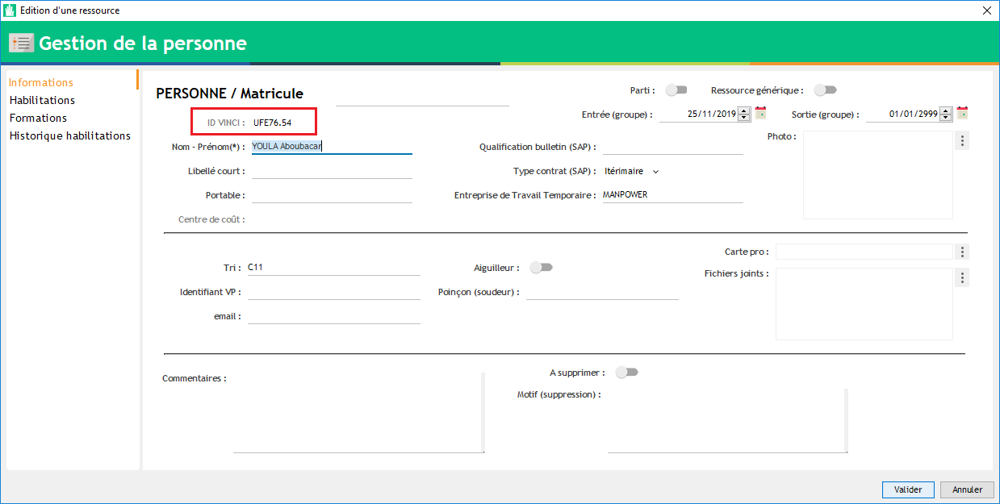

.. vbadge:

======
VBADGE
======

Préambule
---------

Vbadge est une carte, distribuée aux collaborateurs, permettant de récupérer l'ensemble de leurs habilitations / autorisations en temps réel et ainsi de s'affranchir d'une réédition papier à chaque mise à jour de ces dernières. L'accès se fait en scannant le QR Code présent sur le badge, à l'aide de n'importe laquelle des applications disponibles sur les "stores" Android et Apple.

    .. image:: ../_static/fonctionnalitees/vbadge/badge_jean.png

    .. image:: ../_static/fonctionnalitees/vbadge/badge_jeanne.png

Les habilitations / autorisations sont reliées directement à Visual Planning.

    .. image:: ../_static/fonctionnalitees/vbadge/v7_fiche_jeanne.png

Qui peut avoir une carte ?
--------------------------

Seul les personnes importées de KHEOPS peuvent avoir une carte.

C'est à dire :
    - CDI
    - CDD
    - CDIC

.. warning::
    Les **Intérimaires** et **Stagiaires** sont les seuls collaborateurs qui ne peuvent pas obtenir de carte.

    De plus, vous ne pouvez pas demander une carte pour une personne créée manuellement dans Visual Planning.

Comment reconnaître une ressource créée manuellement ?
------------------------------------------------------

Une personne créée manuellement à un ID VINCI commençant par la lettre ``U`` ("U" pour Utilisateur) suivie du code secteur de la ressource et d'un compteur.

Exemple : ``U + SSSS + . + COMPTEUR`` = ``U4302.2293``

Vous pouvez l'observer dans les affichages ou les éditeurs de saisie : ``AFFECTATION PERSONNEL`` + ``PERSONNEL``

.. note::
    Si vous remarquez un doublon dans la liste de votre personnel, vous devez alors effectuer un **Rapprochement**.

    Vous pouvez aller voir la documentation à ce sujet.

Demander une carte pour un collaborateur
----------------------------------------

Pour demander une carte VBADGE, il faut tout d'abord vérifier, dans Visual Planning, les points suivants concernant le collaborateur :
    - ``Photo`` chargée dans la fiche de la personne
    - ``NOM Prénom`` correct (orthographe)
    - ``Qualification de bulletin`` à jour (si volonté de l'imprimer sur le badge)

.. note::
    L'impression de la qualification de bulletin est optionnelle.

    Eviter également les photos trop lourdes (plusieurs Mo). Nous recommandons une résolution d'environ 300x300 pixels.

Après avoir vérifié les données ci-dessus, vous pouvez faire la demande au service informatique par mail (support.vp@etf.fr) en précisant les points suivants :
    - Noms, Prénoms et Secteur (MU) d'appartenance
    - Choix d'impression de la qualification de bulletin
    - Contact (en charge de la réception) et adresse de livraison

Explication de la fiche VBADGE
------------------------------

La fiche VBADGE reprend les informations primordiales d'accès aux emprises ferroviaires (situées en en-tête) et liste les habilitations / autorisations du collaborateur.

Les couleurs
++++++++++++

La couleur verte indique la **Validité** d'une habilitation / autorisation.

La couleur rouge indique l'**expiration** d'une habilitation / autorisation.

    .. image:: ../_static/fonctionnalitees/vbadge/v7_fiche_jeanne_couleur.png

.. note::
    Dans cet exemple, la visite médicale de Jeanne est à jour (Vert = Valide) mais son habilitation électrique B0 est expirée (Rouge = Invalide).

L'en-tête
+++++++++

L'en-tête reprend les informations **nécessaires** à l'accueil d'un collaborateur sur un nouveau site.

On observe :
    - Un scan de la carte pro BTP en cliquant sur le logo de la "carte"
    - La validité des habilitations **Prévention N1** (``N1``) et **Sécurité Ferroviaire** (``SF``)
    - La validité de la **Visite Médicale** (``VM``)
    - Si les critères requis pour accueillir le collaborateur sur le chantier / site sont respectés, alors le logo ``Autorisé`` apparaît ; le cas échéant, il apparaît ``Non Autorisé``.

Voici 2 cas de figure :

    .. image:: ../_static/fonctionnalitees/vbadge/v7_fiche_jean_explicative.png

    .. image:: ../_static/fonctionnalitees/vbadge/v7_fiche_jeanne_explicative.png

.. note::
    Dans cet exemple, Jean n'est pas autorisé à pénétrer sur le chantier car les critères requis ne sont pas vérifiés (= au moins un logo sont rouge) contrairement à Jeanne.

Le corps de la fiche
++++++++++++++++++++

Le corps de la fiche reprend la liste des habilitations / autorisations.

Lorsqu'un symbole ``+`` est présent au bout de la ligne d'une habilitation, cela signifie que des documents ou des précisions y sont attachés.
    - Vous pouvez ouvrir la sous-section contenant les informations supplémentaires en cliquant sur la ligne.
    - Il vous suffit alors de cliquer sur l'URL du document pour l'ouvrir.

Quand tout est fermé :

    .. image:: ../_static/fonctionnalitees/vbadge/fiche_jeanne_ss_closed.png

Puis une fois ouvert :

    .. image:: ../_static/fonctionnalitees/vbadge/fiche_jeanne_ss_open.png
