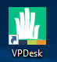
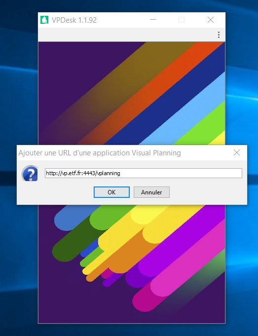
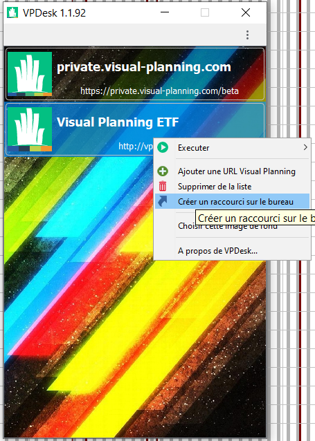
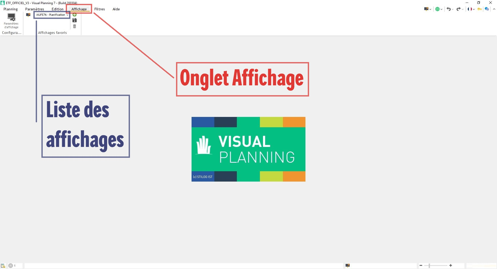

.. _goconvey : https://github.com/smartystreets/goconvey

Comment se connecter ?
======================

Installer VPDesk
-----------------

VPDesk est le lanceur de l'application Visual Planning.

Vous pouvez lancer VPDesk avec l'icône sur votre bureau :

Ou en recherchant VPDesk dans la barre de recherche Windows (par défaut, en bas à gauche) :

.. image:: ../_static/guide/search_vpdesk.png

.. warning::
    * Si l'application VPDesk n'est ni sur votre bureau, ni dans la barre de recherche, vous pouvez la retrouver dans le Centre Logiciel d'Eurovia (taper "software center" dans la barre de recherche Windows) :

    .. image:: ../_static/guide/vpdesk_software_center_1.png    
    
    .. image:: ../_static/guide/vpdesk_software_center_2.png

    * Vous pouvez également télécharger la dernière version de VPDesk (https://www.visual-planning.com/fr/accueil-espace-client/espace-clients-vpdesk) et l'installer, si les droits sur votre poste vous le permettent.

Ajouter le planning ETF
-----------------------

Lors du premier lancement de VPDesk, on vous demandera de renseigner une URL de paramétrage :
    http://vp.etf.fr:4443/vplanning

.. warning::
    Attention à recopier strictement cette URL (sans espace avant, ni après) ; sinon, un message d'erreur apparaîtra.

Vous pouvez ajouter un raccourci sur le bureau pour vous connecter directement au planning ETF (sans passer par VPDesk) :
    - Cliquer droit sur la ligne "Visual Planning ETF"
    - Sélectionner "Créer un raccourci sur le bureau"

.. note::
    Si vous ressentez des difficultés pour vous connecter via ce raccourci (lenteur importante ou arrêt complet de chargement), il faudra supprimer le raccourci puis le recréer.

Compte
------

Votre identifiant est identique à celui utilisé pour accéder à la session Windows.

Lors de votre première connexion, laissez vide le champ de mot de passe puis valider. On vous demandera d'en définir un nouveau à l'étape d'après.

Le mot de passe doit être composé de : ::

    - Une lettre
    - Un chiffre
    - Au moins 4 caractères

.. note::
    Ce mot de passe n'aura pas besoin d'être renouvelé périodiquement.

.. warning::
    Si vous n'avez pas encore de compte Visual Planning ou que vous avez oublié votre mot de passe, contactez l'une des personnes suivantes :
        - Maxime CORDIER : maxime.cordier@etf.fr
        - Julien GUY : julien.guy@etf.fr

Choisir son planning
====================

Lors de votre première connexion à Visual Planning, il vous sera demandé de sélectionner un planning :

    - ETF_OFFICIEL_V3 (planning de production):
        - Gestion du plan de charges
        - Planification des ressources (Personnel, Matériel)
        - Gestion des habilitations
        - Planification des formations
    - ETF_RAPPORT_V3 (planning de dématérialisation des rapports):
        - Rapports soudure/meulage
        - Plan de veille et gestion des contrôles KN
        - Autorisation d'accès aux emprises ferroviaires (SECUFER)

.. warning::
    Les autres plannings visibles sont des plannings de test et de développement. Aucune donnée ne pourra être récupérée depuis ces plannings.

Que faire une fois connecté ?
===============================

Une fois la barre de chargement disparue, vous devez alors demander à Visual Planning de vous afficher des données.

Cliquez sur l'onglet ``Affichage`` dans le ruban (en haut) puis selectionnez un affichage dans la liste des "affichages favoris" :

.. note::
    Lorsque vous femerez manuellement Visual Planning, le dernier affichage ouvert sera conservé en mémoire pour la prochaine connexion.

.. warning::
    Si vous restez trop longtemps inactif dans Visual Planning ou que vous subissez une perte de connexion, vous serez déconnecté automatiquement et le dernier affichage visité ne sera pas gardé en mémoire.

Vocabulaire Visual Planning
============================

Dimension
---------

Une ``dimension`` est une table de données. Il existe une dimension pour chaque "type" de données que nous souhaitons planifier. Voici une liste non exhaustive :

    - "PERSONNELS" : Regroupe l'ensemble des collaborateurs du groupe (sans notion d'appartenance à un périmètre spécifique).
    - "AFFECTATION_P" : Regroupe l'ensemble des affectations du personnel (une personne peut donc avoir plusieurs affectations suivant ses mutations ou mises à disposition entre secteurs).
    - "ABSENCES" : Regroupe les différents types d'absence programmables.
    - "CHANTIERS" : Regroupe l'ensemble des chantiers (ouverts depuis KHEOPS ou créés manuellement dans VP).

On peut comparer une dimension à un tableau Excel.

Rubrique
--------

Une ``dimension`` est constituée de ``rubriques``, c'est-à-dire d'attributs, permettant de qualifier la ressource.

Ces rubriques peuvent être de différentes formes, comme :
    - Du texte à remplir
    - Des fichiers à attacher
    - Des cases à cocher

Exemple avec la dimension ``PERSONNELS`` : ::

    Rubrique "Nom - Prénom" contient le nom et le prénom de la personne
    Rubrique "Parti" permet de préciser si la ressource est active ou non
    Rubrique "Photo" contient une image de la personne

Une rubrique peut être comparée à une colonne d'un tableau Excel.

Ressource
---------

Une ``ressource`` est un item d'une dimension.

Maxime CORDIER est une ressource et ses informations sont : ::

    "Nom - Prénom" : Maxime CORDIER
    "Parti" : Non coché
    "Photo" : Une photo de Maxime CORDIER

Une ressource peut être comparée à une ligne d'un tableau Excel.

Vue
----

Une ``vue`` est une fenêtre. Elle permet d'afficher les données "ressources" et/ou "événements" mises en forme.

Il existe différents types de ``vue`` :

    - **Vue Ressource :**
    C'est une liste de ``ressources`` (personnel, engins, véhicules, chantiers,...). Elle pourra être affichée en tableau ou en liste.

        .. image :: ../_static/guide/v7_vue_ressource_personnel.png

    - **Vue Planning :**
    C'est le planning associé aux ``ressources`` d'une ``dimension`` donnée. Une vue planning sera toujours disposée de la manière suivante.
        - A gauche : une liste des ressources
        - A droite : un planning avec les événements liés à ces ressources

        .. image :: ../_static/guide/v7_vue_planning_explication.png

Affichage
---------

Un ``affichage`` est un ensemble de ``vues`` dont la mise en forme a été sauvegardée. Il peut être ``public`` (tout le monde peut y avoir accès) ou ``privé`` (uniquement disponible depuis le compte qui l'a créé).

.. note::
    Tous les affichages commençant par "_" (Exemple : _Planification) sont des affichages publics à tout ETF.

    Tous les affichages commençant par un Code Secteur "MUXXXX" ou un Code Agence "ACXXXX" (Exemple : MU3939 - Planification) sont des affichages publics, visibles uniquement par les utilisateurs disposant des droits correspondant.

**Le nom d'un affichage correspond, dans la plupart des cas, aux actions qu'il est possible de réaliser dessus.**

Evénement
---------

Un événement est la liaison entre au moins deux ressources différentes à une date donnée.

Par exemple, une absence est un événement contenant :
    - Une ressource **ABSENCE** : ``Congé Payé``
    - Une ressource **PERSONNEL** : ``Maxime CORDIER``
    - Une **date de début** d'événement : ``01/01/2020``
    - Une **date de fin** d'événement : ``08/01/2020``

Un événement apparaît, sur une vue planning, comme une barre délimitée par la date de début et la date de fin.

Filtres
=======

La force de Visual Planning réside dans sa capacité à filtrer les informations affichées (ressources ou événements).

.. note::
    Par défaut, la plupart des vues sont paramétrées sur les ressources de votre périmètre (autrement dit, par rapport aux droits qui vous ont été attribués).

Filtres de Ressources
---------------------

Sur les vues de type "liste de ressources", il y a deux niveaux de filtre :
    - Niveau 1 (= Filtre de la ressource) : il est composé d'une liste de filtres généraux prédéfinis. Par exemple, pour les chantiers, le filtre ``_Chantiers de mon secteur`` permet d'afficher uniquement les chantiers ouverts sur mon secteur.
        
    .. image:: ../_static/guide/filtre_ressources_niveau_1.png
    
    - Niveau 2 (= Filtres rapides de la ressource) : ils permettent de filtrer sur les attributs des ressources. Par exemple, pour les chantiers, le filtre rapide ``Clôturé`` permet d'afficher les chantiers actifs (si Clôturé = Non) ou inactifs (si Clôturé = Oui).

    .. image:: ../_static/guide/filtre_ressources_niveau_2.png

.. warning ::
    Le filtre "général" de la ressource (niveau 1) est toujours plus restrictif que les filtres rapides (niveau 2). 
    Les filtres de niveau 2 permettent de resteindre les informations obtenues avec le filtre de niveau 1.

    Pour aller plus loin, dans la liste du personnel :
        - Si je choisis un filtre de ressources (niveau 1) ``_Personnel de mon secteur`` (qui n'affiche que les collaborateurs appartenant au(x) secteur(s) définis par mes droits VP),
        - Et que je souhaite, par la suite, obtenir l'ensemble du personnel d'un secteur voisin (secteur non compris dans mes droits VP),
        - Si je sélectionne alors, dans le filtre rapide ``Secteur`` (niveau 2), le secteur voisin correspondant,
        - Au final, j'obtiens une liste vide. Pourquoi ? 
        - Voici ce que j'ai littéralement demandé à Visual Planning : "Liste-moi, parmi le personnel de mon secteur (niveau 1), le personnel du secteur voisin (niveau 2)".
        - Effectivement, si le personnel appartient au secteur voisin, il ne peut pas être dans mon secteur (et inversement).
    **Solution** : il faut annuler le filtre de niveau 1 par un filtre moins restrictif (par exemple, basculer le filtre ``_Personnel de mon secteur`` vers ``(Tous)``).
    Littéralement, voici ce que je demande : "Liste-moi, parmi **TOUT** le personnel du groupe (niveau 1), le personnel du secteur voisin (niveau 2)". Dans ce cas-là, j'obtiens le bon résultat.

Filtres d'Evénements
--------------------

Sur toutes les vues contenant des événements (vue planning, rapport d'événements, ...), il y a deux niveaux de filtre pour les ressources (voir paragraphe plus haut) ainsi que deux niveaux de filtre pour les événements :
    - Filtres des ressources : (comme sur une vue ressource)
        - Niveau 1 : Filtres prédéfinis de la ressource considérée. 
        .. note::
            Dans une vue planning, une nouvelle fonctionnalité s'ajoute au niveau 1. Vous avez la possibilité de filtrer les ressources (affichées dans la partie gauche) en fonction de leur planification sur une période donnée.
            Pour ce faire, activer le bouton ``Afficher les (NOM DE LA RESSOURCE) ayant au moins un événement visible`` puis définissez la période sur laquelle vous souhaitez appliquer le filtre.
            
            Exemple : Je suis dans une vue planning personnel filtrée automatiquement sur le personnel de mon secteur.

            .. image:: ../_static/guide/filtre_ressources_EVE_1.png

            Si je souhaite afficher uniquement le personnel programmé en semaine 10, j'active la fonctionnalité et je définis la période considérée (= S10).

            .. image:: ../_static/guide/filtre_ressources_EVE_2.png

            **Résultat** : seul le personnel ayant un événement dans le planning la semaine 10 s'affiche dans la colonne des ressources (à gauche). Autrement dit, le personnel sans planification la semaine 10 ne sera pas visible dans la colonne de gauche.

            .. image:: ../_static/guide/filtre_ressources_EVE_3.png

        - Niveau 2 : Filtres rapides (filtres sur les différents attributs de la ressource). Pas de nouveauté ici.

    - Filtres des événemements :
        Si la partie ``Filtres des événements`` n'est pas automatiquement développée (à cause d'une taille d'écran trop faible notamment), vous devez appuyer sur le bouton suivant :

        .. image :: ../_static/guide/filtre_evenements_bouton.png

        - Niveau 1 (= Filtres d'événements) : il est composé de filtres généraux prédéfinis. Ils permettent de filtrer les événements affichés dans le planning. Voici quelques exemples :
            - ``_Evénements de planification`` : montre tous les événements (hors "Besoins sur chantier" et "Planification de projet").
            - ``_Evénements de BESOINS de mon secteur`` : montre uniquement les événements "Besoins sur chantier".
        - Niveau 2 (= Filtres rapides) : on peut alors filtrer plus précisément sur les différentes dimensions.

.. note::
    Le filtre le moins restrictif dans Visual Planning est le filtre ``(Tous)``.

Raccourcis clavier
===================

===========================     ============================================================================================
Touche                          Action
===========================     ============================================================================================
CTRL + C                        Copier
---------------------------     --------------------------------------------------------------------------------------------
CTRL + X                        Couper
---------------------------     --------------------------------------------------------------------------------------------
CTRL + V                        Coller
---------------------------     --------------------------------------------------------------------------------------------
CTRL + Z                        Retour arrière (annuler dernière action)
---------------------------     --------------------------------------------------------------------------------------------
CTRL + Y                        Retour avant (répéter dernière action)
---------------------------     --------------------------------------------------------------------------------------------
CTRL + A                        Selectionner tout
---------------------------     --------------------------------------------------------------------------------------------
CTRL + CLIQUE GAUCHE            Sélection multiple individuelle
---------------------------     --------------------------------------------------------------------------------------------
MAJUSCULE + CLIQUE GAUCHE       Sélection multiple du premier élément selectionné au dernier
---------------------------     --------------------------------------------------------------------------------------------
GLISSER/DEPOSER                 Créer un événement avec la ressource tenue en souris
---------------------------     --------------------------------------------------------------------------------------------
GLISSER/DEPOSER + CTRL          Modifier un événement existant avec la ressource tenue en souris
===========================     ============================================================================================

.. note::
    Lors de la modification multiple de plusieurs événements, faire un **clique-droit** sur un des éléments sélectionnés (pour ouvrir le menu contextuel) puis cliquer sur **Modifier** pour changer un ou plusieurs paramètres sur l'ensemble des événements.