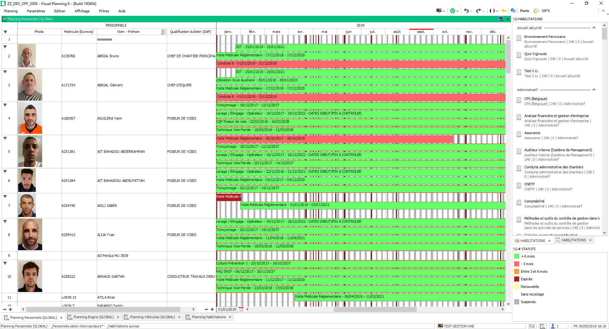

Mise à jour du 02 octobre 2019
=================================

Suivi des habilitations
-------------------------

Modification des informations de la personne
********************************************

- Ajout d'une rubrique carte pro btp dans la personne
    - Permet d'ajouter le scan de la carte pro dans la personne
    - Permet de récupérer cette carte pro sur Vbadge

- Ajout d'une case à cocher "Ressource générique" dans la personne 
    - Permet de catégoriser la ressource en ressource générique*

Editeur de saisie Personnel
****************************

Modification de l'éditeur de saisie personnel pour les adaptations suivantes :
    - Séparation des habilitations valides médicales des autres habilitations

    - Ajout d'un onglet historique de toutes les habilitations

    - Ajout des rubriques :
        - Ressources génériques
        - Carte pro

Ajout de statut
*****************

- Ajout d'une catégorie de statuts "Habilitations"
- Ajout des ressources suivantes :
    - \+ 6 mois
    - Entre 3 et 6 mois
    - \- 3 mois
    - Expirée
    - Suspendu
    - Renouvelée

==================      =========================================   =========================================================
Libellé                 Condition                                   Fonctionnement
==================      =========================================   =========================================================
\+ 6 mois               Date de fin >= 6 mois                       Export/Import : Auto habilitation > 6 mois
------------------      -----------------------------------------   ---------------------------------------------------------
Entre 3 et 6 mois       3 < Date de fin < 6                         Export/Import : Auto habilitation : Entre 3 et 6 mois
------------------      -----------------------------------------   ---------------------------------------------------------
\- 3 mois               Date de fin < 3 mois                        Export/Import : Auto habilitation < 3 mois
------------------      -----------------------------------------   ---------------------------------------------------------
Expirée                 Date de fin < 0                             Export/Import : Auto habilitation : Expirée
------------------      -----------------------------------------   ---------------------------------------------------------
Renouvelée              A un événement d'habilitation plus récent   API : Habilitations
------------------      -----------------------------------------   ---------------------------------------------------------
Suspendu                Manuellement par l'utilisateur              Manuel
------------------      -----------------------------------------   ---------------------------------------------------------
Sans recyclage          Habilitation sans recyclage                 Création de l'événement
------------------      -----------------------------------------   ---------------------------------------------------------
Doublon                 Habilitations identiques aux même dates     API : Habilitation
==================      =========================================   =========================================================

Nouveaux affichages
-------------------

- Séparation de la gestion des habilitations du personnels de la gestion des agréments machine.
- Regroupement de la gestion des habilitations et du tableau de suivi.

Gestion des habilitations
*********************

L'affichage par mois des habilitations n'est pas très lisible et ne permet pas de se rendre compte des habilitations valides de la personne.

L'affichage est maintenant annuel et reprend les couleurs de statut de l'habilitations :

Modification techniques
-----------------------

Hierarchie habilitations
*************************

- Changement du nom de la hierarchie
    - Anciennement "Gestion des habilitations PEV" -> "Ajout d'une habilitation / Agrément
- Ajout du statut
    - Uniquement statut de type habilitation

Automatisation
**************

Par import/Export : *(Effectué à 06:00 et 18:00)*
    - Auto habilitation > 6 mois
    - Auto habilitation : Entre 3 et 6 mois
    - Auto habilitation < 3 mois
    - Auto habilitation : Expirée

.. note::
    Ces exports ont eu base commune de filtre :
        - Uniquement les évenement contenant une ressource **HABILITATION**
        - Ne modifie pas les habilitations notées : Ne plus suivre
        - Ne modifie pas les habilitations : "Suspendu" ou "Renouvelée"

Par API : *(Effectué à 06:00 et 18:00)*
    - Vient vérifier si des recyclages ont été effectués pour passer les habilitations en "Renouvelée"
    - Vient vérifier si l'habilitation n'est pas un doublon

Dimensions de paramétrage
****************************

Les dimensions **STATUTS** et **HABILITATIONS** sont a passer en paramétrage pour récupérer les ajouts ou modifications sur les ressources

Modification des habilitations sans recyclage
**********************************************

Les habilitations sans recyclage passent automatiquement a 20ans de validités pour permettre de les suivres sur le nouveau planning.

Filtres supplémentaire
-----------------------

Filtre d'événement
******************

Filtre de Ressources
*********************

_Type = Habilitation :

Modification des fonctionnalités inutilisées
--------------------------------------------

Certains événements superflux sont resté dans le planning suite à des mises à jours ou des suppressions de fonctionnalités.

PDC
****

Suppressions des événements qui permettaient de calculer le plan de charge lors de la plannification horaire :
    - Nombre d'événement supprimé : **26478**

- La dimension PDC est supprimée
- Les hierarchies comprennant encore les ressources PDC ont été modifiées
- Les imports/export auto du PDC sont supprimé

SOUDURE
*******

La soudure à été migrée sur le planning de rapport

- Suppression de la dimension soudure
- Suppresion des formulaires de soudure :
    - Soudure
    - Meulage
- Suppression des hierarchies liés à la soudure :
    - Rapport soudure
- Suppression des formulaires VPGO

Import automatique
------------------

Désactivation temporaire de la modification automatique de la qualification de bulletin du personnel.