Quelles sont les nouveautés apportées par la version 7 ?
========================================================

Vue active
----------

Dans un affichage, on identifie désormais la vue active par la coloration en orange du nom de cette vue. 
Dans l'affichage ``_Création ressources`` ci-dessous, on remarque que la vue active est la vue planning #GESTION. Les autres vues ressources PERSONNELS, ENGINS et VEHICULES (à droite) apparaissent en noir et ne sont donc pas actives.

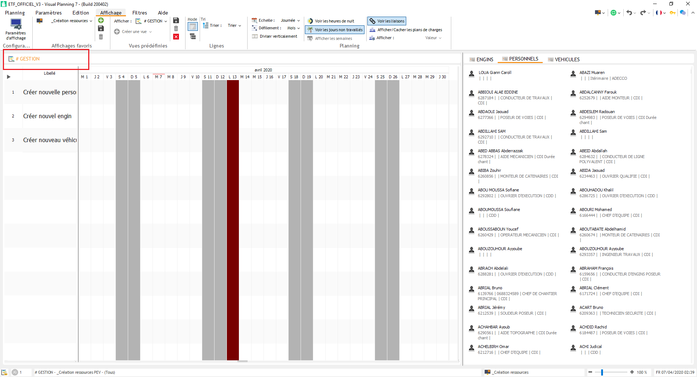

.. note::
    L'onglet **[ Filtres ]** s'adapte en permanence à la vue active. 
    Ainsi, quand vous êtes sur une vue planning des chantiers, on vous proposera des filtres relatifs aux chantiers (``_Chantiers de mon secteur``, ``_Chantiers avec mes ressources``, ...).
    Si vous basculez sur une vue planning du personnel, les filtres proposés changent (``_Personnel de mon secteur``, ``_Personnel selon choix poste``, ...).

En V6, la vue active était remarquable par la couleur verte du bandeau.

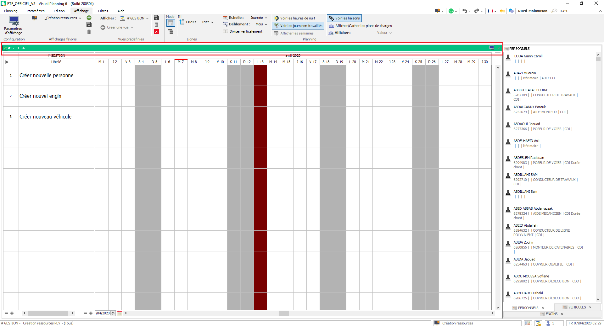

Onglet actif
------------

Lorsque plusieurs vues sont imbriquées dans une même zone d'un affichage, on remarque que les onglets se situent désormais dans la partie supérieure de cette zone et que l'onglet actif est souligné.
Par exemple, dans l'affichage ``_Création ressources``, c'est le cas des vues ressources PERSONNELS, ENGINS et VEHICULES (à droite) ; ici, c'est l'onglet PERSONNELS qui est actif.

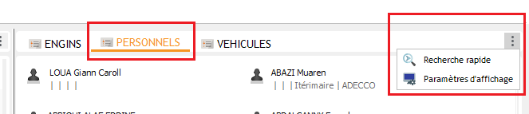

.. note::
    On remarquera également que les paramètres d'affichage ou la recherche rapide sont accessibles depuis les "3 points verticaux" dans le bandeau de la vue.

En V6, les onglets se situaient en partie inférieure de la vue et les paramètres étaient directement accessibles dans le bandeau.

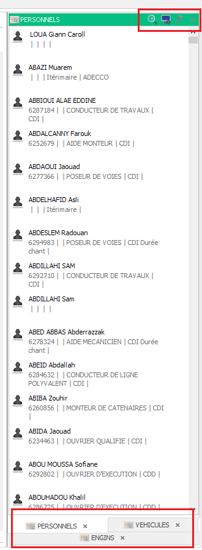

Colonnes de description
-----------------------

Lors de la sélection d'une ressource dans une liste, on avait la possibilité d'ajouter ou de modifier les colonnes qui décrivent les ressources.
Dans l'exemple suivant, je dois sélectionner un secteur. 

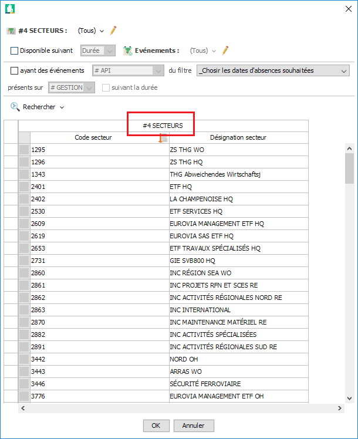

Les informations affichées sont :
    - Code secteur
    - Désignation secteur

A titre d'exemple, si je ne connais le secteur que par son représentant (= chef de secteur), je dois alors ajouter une colonne de description supplémentaire (= ``Représentant Secteur``).

Pour ce faire, en V6, je devais double-cliquer sur l'en-tête de colonne ``#4 SECTEURS`` pour afficher la fenêtre suivante :

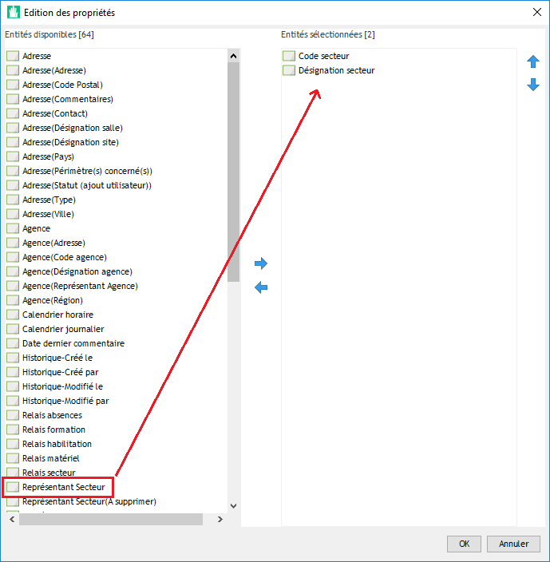

En V7, cet en-tête ``#4 SECTEURS`` n'apparaît plus. Il faudra alors double-cliquer sur l'une des colonnes de description déjà présente (``Code secteur`` ou ``Désignation secteur``) pour afficher la même fenêtre que précédemment.

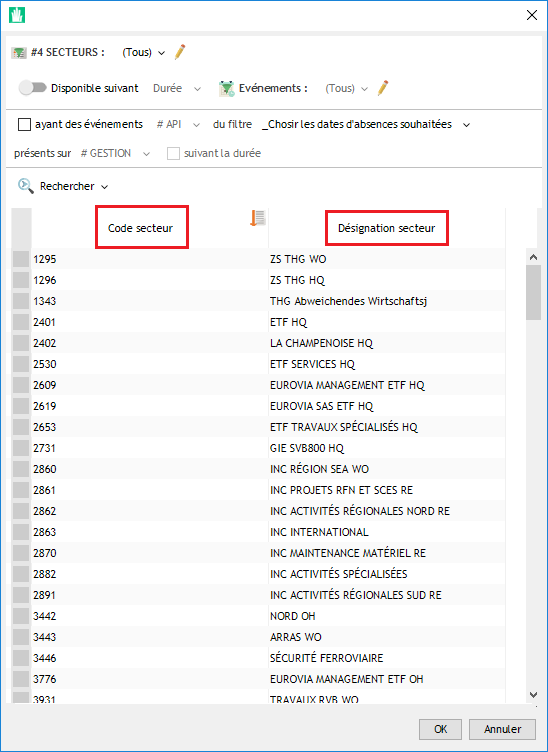

Menu contextuel (ressources)
----------------------------

Le menu contextuel d'une ressource est ce qui apparaît lors d'un clique-droit sur cette dernière (personnel, engin, véhicule, chantier, ...).

En V6, toutes les options s'affichent et ce qui est non-accessible est grisé.

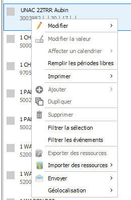

En V7, seules les options accessibles sont affichées et celles-ci sont réorganisées.

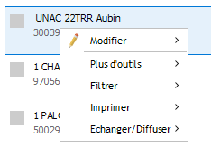

Menu contextuel (événements)
----------------------------

Le menu contextuel d'un événement est ce qui apparaît lors d'un clique-droit sur ce dernier (planification sur chantier, formation, habilitation, ...).

En V6, toutes les options du menu contextuel étaient visibles mais non organisées.

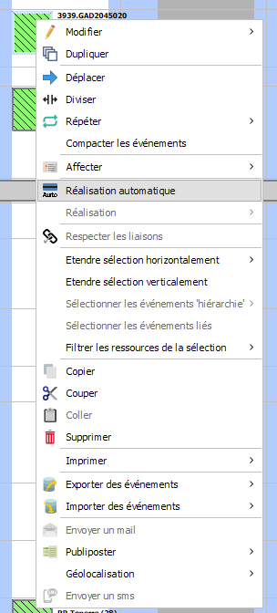

En V7, les options du menu contextuel sont mieux organisées. 

Ainsi, les fonctions ``Déplacer``, ``Diviser`` et ``Répéter`` sont regroupées sous l'item ``Plus d'outils``.

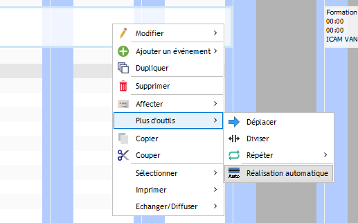

De plus, la fonction ``Publiposter`` est désormais accessible depuis l'item ``Echanger / Diffuser``.

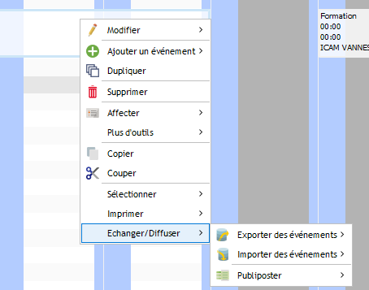

Se déplacer dans un planning
----------------------------

Dans une vue planning, le curseur horizontal est par défaut minimisé. Pour le faire apparaître, il faudra déplacer sa souris dans la partie basse du planning.

Sélectionner une ressource
--------------------------

Que ce soit dans un éditeur de ressource ou d'événement, la sélection d'une ressource se fait désormais au travers des "3 points verticaux". On obtient alors les 3 mêmes options qu'auparavant :
    - Choisir (la loupe) : sélectionner une ressource dans une liste
    - Editer (le crayon) : modifier les rubriques de la ressource affectée dans l'éditeur
    - Supprimer (la poubelle) : supprimer l'affectation de la ressource

En V7 :

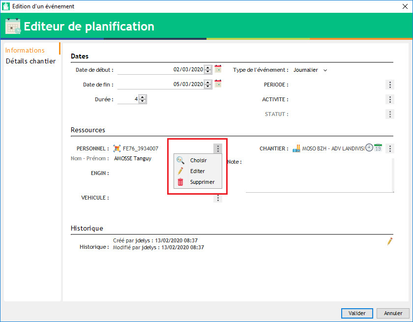

En V6 :

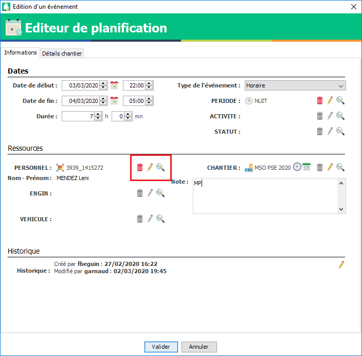

Modification liées aux ressources
---------------------------------

**PERSONNELS :**
    - La rubrique ``Parti`` est devenue ``Sortie KHEOPS`` et n’est plus modifiable. Elle se mettra automatiquement à jour avec les imports KHEOPS.
    - Une rubrique (case à cocher) ``Cacher`` a été ajoutée : si cochée, la ressource ne sera pas visible dans vos plannings ou vos listes.
    - Le responsable direct de la personne est maintenant importé depuis KHEOPS. Il n’est pas modifiable.
    - La ville de résidence de la personne est maintenant importée depuis KHEOPS.

**ENGINS / VEHICULES :**
    - La rubrique ``Démobilisé`` est devenue ``Sortie KHEOPS`` et n’est plus modifiable. Elle se mettra automatiquement à jour avec les imports KHEOPS.
    - Une rubrique (case à cocher) ``Cacher`` a été ajoutée : si cochée, la ressource ne sera pas visible dans vos plannings ou vos listes.

**CHANTIERS :**
    - La rubrique ``Clôturé`` est devenue ``Sortie KHEOPS`` et n’est plus modifiable. Elle se mettra automatiquement à jour avec les imports KHEOPS.
    - Une rubrique (case à cocher) ``Cacher`` a été ajoutée : si cochée, la ressource ne sera pas visible dans vos plannings ou vos listes.
    - La liste déroulante de sélection d’un pays est devenue une liste de ressource **PAYS**. Le pays est maintenant importé automatiquement de KHEOPS.

**AFFECTATION_P :**
    - La rubrique ``Parti`` est devenue ``Cacher`` : si cochée, la ressource ne sera pas visible dans vos plannings ou vos listes.

**AFFECTATION_E / AFFECTATION_V :**
    - La rubrique ``Démobilisé`` est devenue ``Cacher`` : si cochée, la ressource ne sera pas visible dans vos plannings ou vos listes.
